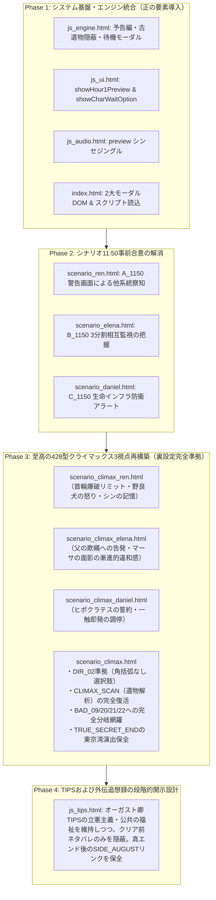

# 『パラレル・ジャパニア：クロニクル』
# 107リポジトリ vs pallarerujapania 詳細DIFF・要素抽出および改修方針設計書

---

## 1. 調査の背景と

### 1.1 背景
`i:\マイドライブ\Obsidian Vault\Obsidian00\spacebro2\107`（以下「**107**」）は、ゲーム進行上の停止バグ、待機キャラクター選択時のUI操作不能、およびクライマックスが単一ファイルで箇条書きダイジェストになっていた不満を解消するため、応急的に修正が行われたリポジトリである。

しかし、107の修正は「現在の状況で起こったエラーを、裏設定やキャラクター仕様・伏線開示ペース・教育的叙述トリックを十分に考慮せずに修正された」ものである。

### 1.2 本書の目的
107をそのまま `pallarerujapania` に上書き適用するのではなく、
1. 107において**解決された優れた技術的・演出的一面（採用すべき要素）**を精密に抽出する。
2. 107において**裏設定や制作ガイドライン（AGENTS.md）を無視して生じてしまった劣化・瑕疵（修正・再構築すべき課題）**を特定する。
3. 両リポジトリの**行単位・ノード単位の詳細なDIFF**を可視化・記録する。
4. 今後 `pallarerujapania` のファイルを安全かつ最高品質に修正するための方針を確定する。
※なお、ユーザー指示に基づき、現段階ではコード本体の更新は行わず、ファイル化による方針策定に専念する。

---

## 2. ファイル構成および全体差分マトリクス

### 2.1 リポジトリ間 ファイル存在対比

| ファイル名 | 107 | pallarerujapania | 状態・差異 |
| :--- | :---: | :---: | :--- |
| `scenario_climax.html` | ○ (58,888 B) | ○ (64,679 B) | **要統合**：ノード構造大幅変更（CLIMAX_SCAN削除、HUB改変） |
| `scenario_climax_ren.html` | ○ (5,827 B) | × (未存在) | **107新規**：レン視点クライマックス専用モジュール |
| `scenario_climax_elena.html` | ○ (5,307 B) | × (未存在) | **107新規**：エレナ視点クライマックス専用モジュール |
| `scenario_climax_daniel.html` | ○ (5,482 B) | × (未存在) | **107新規**：ダニエル視点クライマックス専用モジュール |
| `scenario_ren.html` | ○ (27,553 B) | ○ (26,363 B) | **要改修**：11:50のセリフ（事前合意の排除） |
| `scenario_elena.html` | ○ (28,904 B) | ○ (27,695 B) | **要改修**：11:50のセリフ（事前合意の排除） |
| `scenario_daniel.html` | ○ (26,054 B) | ○ (24,893 B) | **要改修**：11:50のセリフ（事前合意の排除） |
| `js_engine.html` | ○ (38,448 B) | ○ (37,389 B) | **要統合**：予告編バナー、古遺物隠蔽、待機モーダル |
| `js_ui.html` | ○ (39,165 B) | ○ (36,761 B) | **要統合**：`showHour1Preview`、`showCharWaitOption` 追加 |
| `js_audio.html` | ○ (6,108 B) | ○ (4,827 B) | **要統合**：`preview` シンセジングル追加 |
| `js_tips.html` | ○ (17,519 B) | ○ (18,015 B) | **要注意**：オーガスト卿のTIPS改定（裏設定削除問題） |
| `index.html` | ○ (78,457 B) | ○ (71,693 B) | **要統合**：新シナリオ3ファイル読込、新モーダル2種DOM |
| `appsscript.json` | ○ (203 B) | ○ (193 B) | **設定差**：`ANYONE_ANONYMOUS` vs `ANYONE` |
| `modification_report.xml` | ○ (49,429 B) | × | 107改修レポート（参考資料） |
| 仕様書・設計書群（15件） | × | ○ | `pallarerujapania` 側にのみ詳細設定資料群が完全配備 |
| 画像アセット・最適化スクリプト | × | ○ | `pallarerujapania` 側にのみ画像関連スクリプト配備 |

---

## 3. ファイル別 詳細DIFF徹底解剖

### 3.1 `scenario_climax.html` および 新規3視点シナリオ

#### (1) ノード構成の比較
* **pallarerujapania（現在）**:
  - `CLIMAX_HUB`（12:00 集結・単一ファイル・箇条書きダイジェスト）
  - `CLIMAX_SCAN`（12:15 古遺物スキャン解析・憲法条文等の叙述トリック開示 ➔ `BAD_09`, `BAD_20`, `BAD_22` への分岐を含む）
  - `CLIMAX_DECISION`（同時キー押し意思決定 ➔ `BAD_10`〜`BAD_13`）
  - `CLIMAX_RESOLVE` ➔ `ENDING_BRANCH` ➔ 各種エンディング
* **107（修正版）**:
  - `CLIMAX_HUB`（12:00 視点選択ハブ ➔ `CLIMAX_REN_START` / `CLIMAX_ELENA_START` / `CLIMAX_DANIEL_START` へ分岐）
  - **新規3ファイル（各3ノード、計9ノード）**:
    - `scenario_climax_ren.html`: `CLIMAX_REN_START` ➔ `CLIMAX_REN_01` ➔ `CLIMAX_REN_CONSOLE`
    - `scenario_climax_elena.html`: `CLIMAX_ELENA_START` ➔ `CLIMAX_ELENA_01` ➔ `CLIMAX_ELENA_CONSOLE`
    - `scenario_climax_daniel.html`: `CLIMAX_DANIEL_START` ➔ `CLIMAX_DANIEL_01` ➔ `CLIMAX_DANIEL_CONSOLE`
  - `CLIMAX_CONVERGE_HUB`（12:15 三者結集・合流ハブ）
  - `CLIMAX_DECISION` ➔ `CLIMAX_RESOLVE` ➔ `ENDING_BRANCH`

#### (2) 主な行差分とノードの中身
```diff
--- pallarerujapania: scenario_climax.html (CLIMAX_HUB)
+++ 107: scenario_climax.html (CLIMAX_HUB)
-  "CLIMAX_HUB": {
-    id: "CLIMAX_HUB", char: "ALL", charName: "三人の集結", time: "12:00",
-    stage: "12:00 中央統治タワー最上階・中央管制室", title: "三つの光の激突",
-    paragraphs: [
-      "ガシャァァンッ！",
-      "重厚な二重隔壁が火花を散らして吹き飛び、三つの影が同時に部屋へとなだれ込んだ！",
-      "・レン：首輪から青白い火花を散らし、鉄パイプを構えた少年の瞳には怒りの炎が宿る。",
-      "・エレナ：泥で汚れたドレスの裾を気に留めることもなく、データ端末を握りしめた令嬢。",
-      "・ダニエル：煤にまみれた白衣を翻し、聴診器を首に巻いた医師の眼差しには悲壮な決意があった。"
-    ],
-    choices: [
-      { text: "三人が持ち寄った古代の遺物を、中央の光学スキャナにかける！", next: "CLIMAX_SCAN" }
-    ]
-  }
+  "CLIMAX_HUB": {
+    id: "CLIMAX_HUB", char: "ALL", charName: "三人の集結", time: "12:00",
+    stage: "12:00 中央統治タワー最上階・三方ゲート", title: "三つの光の激突（視点選択）",
+    paragraphs: [
+      "ガシャァァンッ！",
+      "東・西・南の三重隔壁が火花を散らして同時に吹き飛び、タワー最上階の円形チャンバーへ三つの影がなだれ込んだ！",
+      "首輪から青白い火花を散らし鉄パイプを構えるスラムの少年レン、データ端末を握りしめ泥にまみれたドレスのエレナ、煤けた白衣を翻し工具バーを構える医師ダニエル。",
+      "誰が敵で、誰が味方かもわからぬ極限の混乱の中、それぞれの主観と運命が激突する！ まず誰の視点からこの決戦へ挑むか！？"
+    ],
+    choices: [
+      { text: "【レン視点】野良犬の怒りを解き放ち、首輪の爆破カウントダウンに抗う！", next: "CLIMAX_REN_START" },
+      { text: "【エレナ視点】父オーガスト卿の玉座へ！ 特権階級の罪を自ら告発する！", next: "CLIMAX_ELENA_START" },
+      { text: "【ダニエル視点】命を見殺しにさせない！ 医師の誓約で間へ割って入る！", next: "CLIMAX_DANIEL_START" }
+    ]
+  }
```

```diff
--- pallarerujapania: scenario_climax.html (CLIMAX_SCAN から CLIMAX_CONVERGE_HUB への改変)
-  "CLIMAX_SCAN": {
-    id: "CLIMAX_SCAN", char: "ALL", charName: "古代遺物の共鳴", time: "12:15",
-    stage: "12:15 中央統治タワー最上階・古代解析コンソール", title: "失われた人権の開示",
-    paragraphs: [
-      "光学スキャナが青白い閃光を放ち、三人が持ち寄った遺物の表面に焼き付いた錆と汚れを焼き払っていく。",
-      "「……おい、文字が浮き出てきたぞ……！？」レンが息を呑む。",
-      "・レンの遺物：『東京都 新宿区』……かつてこの地に存在した都市の名前。",
-      "・エレナの遺物：『日本国憲法 第14条・第97条』……何人にも侵されない永久の権利の記憶。",
-      "・ダニエルの遺物：『厚生労働省 災害医療備蓄箱』……すべての命を等しく救う国家の誓約。",
-      ...
-    ],
-    choices: [
-      { text: "タワー統治中枢のシャットダウン最終コンソールを展開する！", next: "CLIMAX_DECISION" },
-      { text: "迫る防衛AIのカウントダウンに焦り、緊急停止キーを力任せに連打する！", next: "BAD_09" },
-      { text: "防衛AIの冷却炉心に飛び込み、過負荷を手動短絡して仲間を守ろうとする！", next: "BAD_20" },
-      { text: "チャンバー内に充満する防衛催涙ガスを抜くため、非常排気バルブを最大開放する！", next: "BAD_22" }
-    ]
-  }
+  "CLIMAX_CONVERGE_HUB": {
+    id: "CLIMAX_CONVERGE_HUB", char: "ALL", charName: "三者の集結", time: "12:15",
+    stage: "12:15 中央統治タワー最上階・中枢コンソール", title: "三つの光の結集",
+    paragraphs: [
+      "言葉は少なくとも、三人は互いの瞳の奥にあるものを確かに悟った。",
+      "自由を求めて走ってきた少年レン。平等を求めて特権を捨てた令嬢エレナ。命の尊厳を守るために立ち上がった医師ダニエル。",
+      "「……敵じゃねえ。オレたちは、同じ目的でここまで来たんだ」レンの鉄パイプを握る指から力が抜ける。",
+      "エレナもスタンガンを収め、固く頷いた。「ええ。父が敷いた身分制度と冷酷な搾取を、今こそ終わらせます！」",
+      "ダニエルも白衣の煤を払い、二人に力強い視線を送った。「命に優劣などない。人間が人間として明日を生きる権利を、この都市に取り戻すんだ！」",
+      "ホール中央の巨大メインフレームが三人の生体反応を感知し、青白く脈動を始めた。東・西・南の端末から承認シグナルが同期し、最終停止コンソールが厳かにせり上がってくる！"
+    ],
+    choices: [
+      { text: "三つの管制スロットを連動させ、シャットダウン最終意思決定へ進む！", next: "CLIMAX_DECISION", slot: "CLIMAX_HUB_ACTION", flagValue: "START_DECISION" },
+      { text: "迫る哨戒ドローンの接近音に焦り、三人の認証を待たずに主電源ケーブルを工具で叩き折る！", next: "BAD_21", slot: "CLIMAX_HUB_ACTION", flagValue: "SEVER_CABLE", fx: "flash" }
+    ]
+  }
```

```diff
--- pallarerujapania: scenario_climax.html (ENDING_BRANCH の古遺物判定)
+++ 107: scenario_climax.html (ENDING_BRANCH の古遺物判定)
@@ -184,8 +276,21 @@
-      "三人が回収した古遺物の共鳴が、さらなる真実の扉を照らし出す……。"
+      "タワーの外壁ガラスが開き、爽やかな海風が吹き込んできた。",
+      "街からは、何十年ぶりかに響く人々の歓声と歌声が聞こえてくる。",
+      function(state) {
+        var flags = state.userFlags || [];
+        var hasA = flags.indexOf("PIECE_A") !== -1;
+        var hasB = flags.indexOf("PIECE_B") !== -1;
+        var hasC = flags.indexOf("PIECE_C") !== -1;
+        if (hasA && hasB && hasC) {
+          return "その時、三人が道中で手に入れた謎の金属板が、青く眩い光を放ちながら共鳴を始めた……！ 隠蔽されていた真実の歴史、失われた古文書の扉が今まさに開かれようとしている！";
+        }
+        return "自由と平等、そして命の尊厳を勝ち取った三人は、確かな足取りで新たな時代の夜明けへと踏み出した。";
+      }
     ],
     choices: [
       {
-        text: "結末の刻を迎える（古遺物の収集状況で分岐）",
-        checkSecret: true
+        text: "新憲法の夜明け、自由な未来へ踏み出す！",
+        next: "NORMAL_CLEAR"
       },
       {
-        text: "集めた記憶を胸に、未来へ踏み出す",
-        checkSecret: true
+        text: "共鳴する三つの古遺物に従い、失われた世界の真実へ進む（周回・全古遺物限定）",
+        checkSecret: true,
+        requiresSecretPieces: true
       }
     ]
```

```diff
--- pallarerujapania: scenario_climax.html (地名置換の差異)
+++ 107: scenario_climax.html (地名置換の差異)
@@ BAD_02 @@
-      "光の届かぬ東京湾の海底トンネルへと、レンの意識は永遠に沈んでいった。"
+      "光の届かぬジャパニア湾の海底トンネルへと、レンの意識は永遠に沈んでいった。"

@@ TRUE_SECRET_END @@
-    title: "13:00【東京湾の夜明け、新世紀の日本国憲法】",
+    title: "13:00【ジャパニア湾の夜明け、新世紀の日本国憲法】",
-        actTitle: "第3幕：東京湾の夜明け",
+        actTitle: "第3幕：ジャパニア湾の夜明け",
-      "エレナは強く涙を拭い、割れたガラス窓の向こう、朝陽に輝く東京湾と、歓声を上げる人々の街をまっすぐに見つめた。",
+      "エレナは強く涙を拭い、割れたガラス窓の向こう、朝陽に輝くジャパニア湾と、歓声を上げる人々の街をまっすぐに見つめた。",
```

---

### 3.2 `scenario_ren.html`, `scenario_elena.html`, `scenario_daniel.html` (11:50 終端)

3人全員が未対面であるにもかかわらず、以前のテキストでは事前に示し合わせていたような表現になっていた箇所を、107では「防衛AIの多重クラッキング警告」によって他系統の侵入者を察知する形に改修している。

#### `scenario_ren.html` (A_1150)
```diff
--- pallarerujapania: A_1150
+++ 107: A_1150
@@ paragraphs @@
-      "「おい、東の管制室へ着いたぞ……！ 西と南の仲間たち、合図を送るぞ！」",
-      "レンはコンソールの送信スイッチを叩いた。モニターに二つの同期信号が点滅する。",
-      "「よし、三つの管制室の同期シグナルが揃った……！ いよいよ最上階の中央管制室へ突入だ！」"
+      "「ぐっ……ここが東翼・軍事防衛ラインの管制コンソールか……！」",
+      "レンは鉄パイプを床に突き立て、コンソールの非常インターフェースを力任せに操作した。その時、主モニターがけたたましい警告音と共に赤く点滅した！",
+      "『警告：西翼・政庁電算室、および南翼・生命インフラ区への同時多発的クラッキングを検知。3重複合防衛プロトコルに重大な不整合が発生中。』",
+      "「……なに！？ 西と南にも、誰かが殴り込んでるのか……！？ 名前も顔も知らねえが、オレと同じようにこのイカれた都市をぶっ壊そうとしてる奴がいる！」",
+      "レンの口元に獰猛な笑みが浮かぶ。「上等だ……！ 誰だか知らねえが、足引っ張んじゃねえぞ！ 最上階で会おうぜ！」"

@@ choices @@
-        text: "東管制端末のスロットにキーを押し込み、トリプル・シンクロを要求する！"
+        text: "首輪の痛みを耐え、東翼の防衛解除キーを渾身の力で押し込む！"
-        text: "回線を開き「西と南の管制室、誰かいるか！？」と呼びかける！"
+        text: "制御盤の通信スピーカーを開き「西と南のどっかにいる奴！ 聞こえるか、こちらは東翼だ！」と叫ぶ！"
```

#### `scenario_elena.html` (B_1150)
```diff
--- pallarerujapania: B_1150
+++ 107: B_1150
@@ paragraphs @@
-      "東と南の管制室から、同期信号が送られてくるのをエレナは固唾を呑んで見つめる。",
-      "「頼むわ……スラムで立ち上がった誰かも、命を賭けて戦う同志たちも、どうか無事でいて……！」"
+      "父オーガスト卿の歪んだ血統管理と身分統制を破棄するため、エレナは西翼・政庁電算室のマスターコンソールへ辿り着いた。",
+      "「お父様、あなたの作った偽りの秩序は、私が終わらせます……！」",
+      "端末に特権カードキーを差し込んだ瞬間、赤色のアラートウィンドウが展開した。",
+      "『警告：最高位法務・戸籍データベースの完全リセットには、３大統治ブロック【東翼：軍事防衛】【西翼：政庁電算】【南翼：生命インフラ】の同時トリプル・オーバーライドが必要。』",
+      "「……そんな。一人ではシステムを止められない構造になっているの……！？ 父様は部下すら信じず、３分割の相互監視ロックを敷いていたのね……！」"

@@ choices @@
-        text: "西管制端末からトリプル・シンクロの同調コードを打ち込む！"
+        text: "震える指で政庁電算のマスターキーを押し下げ、見知らぬ同志たちの突破を信じる！"
-        text: "音声チャンネルを開き「東と南の端末、認証コードを受信できる！？」と呼びかける！"
+        text: "通信モニタの非常ラインを繋ぎ「東翼と南翼の侵入者の方！ こちらは西の政庁電算室です！」とマイクに叫ぶ！"
```

#### `scenario_daniel.html` (C_1150)
```diff
--- pallarerujapania: C_1150
+++ 107: C_1150
@@ paragraphs @@
-      "ダニエルは南管制室のメインコンソールに到達した。",
-      "「エマ、レオ、ゴードン……スラムの命の灯火は決して消させない。あとは東と西の仲間たちとタイミングを合わせるだけだ！」"
+      "ダニエルは息を乱しながら、南翼・生命インフラ管制室のメインコンソールへ飛び込んだ。",
+      "「レオ、エマ、ゴードン……スラムの命の灯火は、絶対に消させない……！」",
+      "コンソールに手を掛けた瞬間、けたたましいアラート音が響き渡り、ホログラム警告が赤く明滅した。",
+      "『警告：全都市の生命維持統制解除には、統治タワー３大権限【東翼：軍事防衛】【西翼：政庁電算】【南翼：生命インフラ】の同時承認プロトコルが必要。単独解除不可。』",
+      "「……なっ！？ 単独じゃ解除できないだと！？ オーガスト卿め、クーデターを恐れて３重の分割ロックをかけていたのか……！」"

@@ choices @@
-        text: "南管制スロットにキーを差し込み、トリプル・シンクロを要求する！"
+        text: "震える手で生命インフラの承認キーを押し込み、東と西の誰かに希望を託す！"
-        text: "回線を開き「東と西の同志たち、こちらは準備完了だ！」と応答する！"
+        text: "非常通信モニタのマイクを開き「東と西の侵入者！ 聞こえるか、こちらは南の生命維持区だ！」と呼びかける！"
```

---

### 3.3 `js_engine.html`

```diff
--- pallarerujapania: js_engine.html
+++ 107: js_engine.html
@@ MASTER_DB nodes @@
-  nodes: Object.assign({}, SCENARIO_REN, SCENARIO_ELENA, SCENARIO_DANIEL, SCENARIO_CLIMAX)
+  nodes: Object.assign({}, SCENARIO_REN, SCENARIO_ELENA, SCENARIO_DANIEL, SCENARIO_CLIMAX_REN, SCENARIO_CLIMAX_ELENA, SCENARIO_CLIMAX_DANIEL, SCENARIO_CLIMAX)

@@ 11:00 Hour 1 終端の処理 @@
-    if ((node.id === "A_1100" || node.id === "B_1100" || node.id === "C_1100") && !prog.hour1.allClear) {
+    if (node.id === "A_1100" || node.id === "B_1100" || node.id === "C_1100") {
+      if (!prog.hour1.allClear) {
+        ...
+      } else {
+        // 全員がHour 1を突破した場合：428風予告編バナーを常設
+        var prevBtn = document.createElement("button");
+        prevBtn.className = "w-full text-left p-4 bg-gradient-to-r from-emerald-950/90 via-neutral-900 to-sky-950/90 border-2 border-emerald-400 rounded-xl text-xs sm:text-sm font-black text-emerald-200 shadow-xl flex items-center justify-between group cursor-pointer animate-pulse";
+        prevBtn.innerHTML = '<span>🎬【第1アワー突破！】ここまでのあらすじ ＆ 次章予告編を見る</span>'
+          + '<span class="text-emerald-400 font-mono text-xs">PREVIEW ▶</span>';
+        prevBtn.onclick = function(e) {
+          e.stopPropagation();
+          UIController.showHour1Preview();
+        };
+        wrapper.appendChild(prevBtn);
+        if (!state.hour1PreviewSeen) {
+          setTimeout(function() { UIController.showHour1Preview(); }, 350);
+        }
+      }
+    }

@@ 選択肢の古遺物隠蔽 @@
+      if (ch.requiresSecretPieces) {
+        var flags = state.userFlags || [];
+        var hasA = flags.indexOf("PIECE_A") !== -1;
+        var hasB = flags.indexOf("PIECE_B") !== -1;
+        var hasC = flags.indexOf("PIECE_C") !== -1;
+        if (!hasA || !hasB || !hasC) return;
+      }

@@ キャラ選択クリックのブロック撤廃 @@
-      if (!prog.hour1.allClear) {
-        if (prog.hour1[targetChar]) {
-          AudioEngine.play('tap');
-          UIController.showToast("この主人公は第1アワー（10:00〜11:00）をクリア済みです...\n他の主人公を進めてください。");
-          return;
-        }
-      }
-      if (prog.hour1.allClear && !prog.hour2.allClear) {
-        if (prog.hour2[targetChar]) {
-          AudioEngine.play('tap');
-          UIController.showToast("この主人公は第2アワー（11:00〜12:00）をクリア済みです...\n他の主人公を進めてください。");
-          return;
-        }
-      }
+      var isWaitingH1 = (!prog.hour1.allClear && prog.hour1[targetChar]);
+      var isWaitingH2 = (prog.hour1.allClear && !prog.hour2.allClear && prog.hour2[targetChar]);
+      if (isWaitingH1 || isWaitingH2) {
+        AudioEngine.play('tap');
+        UIController.showCharWaitOption(targetChar, isWaitingH1 ? 1 : 2);
+        return;
+      }
```

---

### 3.4 `js_ui.html`

```diff
--- pallarerujapania: js_ui.html
+++ 107: js_ui.html
@@ 643行目付近に追加 @@
+  function showHour1Preview() {
+    AudioEngine.play('preview');
+    var modal = document.getElementById("modalHour1Preview");
+    if (!modal) return;
+    modal.classList.remove("hidden");
+    var state = TimelineState.getState();
+    state.hour1PreviewSeen = true;
+    TimelineState.saveLocal();
+    var btn = document.getElementById("btnStartHour2FromPreview");
+    if (btn) {
+      btn.onclick = function() {
+        AudioEngine.play('tap');
+        modal.classList.add("hidden");
+        switchView('auth');
+        renderTimeBlockStatus();
+      };
+    }
+  }
+
+  function showCharWaitOption(charKey, hourNum) {
+    AudioEngine.play('tap');
+    var modal = document.getElementById("modalCharWaitOption");
+    if (!modal) return;
+    var cName = charKey === "A" ? "レン（自由権）" : charKey === "B" ? "エレナ（平等権）" : "ダニエル（社会権）";
+    var titleEl = document.getElementById("charWaitModalTitle");
+    if (titleEl) titleEl.textContent = cName + " は第" + hourNum + "アワー待機中です";
+    var descEl = document.getElementById("charWaitModalDesc");
+    if (descEl) {
+      descEl.textContent = hourNum === 1
+        ? "第1アワー（10:00〜11:00）を突破し、他の主人公の到達を待っています。現在のシーンを確認するか、タイムラインを開いて過去の選択肢を変更できます。"
+        : "第2アワー（11:00〜12:00）を突破し、管制室で待機中です。現在のシーンを確認するか、タイムラインを開いて過去の分岐へジャンプできます。";
+    }
+    modal.classList.remove("hidden");
+    var btnGo = document.getElementById("btnCharWaitGoScene");
+    if (btnGo) {
+      btnGo.onclick = function() {
+        AudioEngine.play('tap');
+        modal.classList.add("hidden");
+        GameEngine.switchChar(charKey);
+      };
+    }
+    var btnChart = document.getElementById("btnCharWaitOpenChart");
+    if (btnChart) {
+      btnChart.onclick = function() {
+        AudioEngine.play('tap');
+        modal.classList.add("hidden");
+        openChart();
+      };
+    }
+    var btnClose = document.getElementById("btnCharWaitClose");
+    if (btnClose) {
+      btnClose.onclick = function() {
+        AudioEngine.play('tap');
+        modal.classList.add("hidden");
+      };
+    }
+  }

@@ UIController の return オブジェクト @@
     showToast: showToast,
+    showHour1Preview: showHour1Preview,
+    showCharWaitOption: showCharWaitOption,
     openChart: openChart,
```

---

### 3.5 `js_audio.html`

```diff
--- pallarerujapania: js_audio.html
+++ 107: js_audio.html
@@ play() 内の音声種別判定 @@
+    } else if (type === 'preview') {
+      // 428風 緊迫の電脳シンセジングル（ベースパルス＋鋭いシーケンスアルペジオ）
+      var bassNotes = [110, 110, 146.83, 164.81];
+      bassNotes.forEach(function(f, i) {
+        var osc = ctx.createOscillator();
+        var gain = ctx.createGain();
+        osc.type = "sawtooth";
+        osc.frequency.setValueAtTime(f, now + i * 0.2);
+        gain.gain.setValueAtTime(0.18, now + i * 0.2);
+        gain.gain.exponentialRampToValueAtTime(0.001, now + i * 0.2 + 0.35);
+        osc.connect(gain);
+        gain.connect(ctx.destination);
+        osc.start(now + i * 0.2);
+        osc.stop(now + i * 0.2 + 0.35);
+      });
+      var leadNotes = [440, 523.25, 659.25, 880, 783.99, 1046.50];
+      leadNotes.forEach(function(f, i) {
+        var osc = ctx.createOscillator();
+        var gain = ctx.createGain();
+        osc.type = "square";
+        osc.frequency.setValueAtTime(f, now + 0.8 + i * 0.12);
+        gain.gain.setValueAtTime(0.14, now + 0.8 + i * 0.12);
+        gain.gain.exponentialRampToValueAtTime(0.001, now + 0.8 + i * 0.12 + 0.25);
+        osc.connect(gain);
+        gain.connect(ctx.destination);
+        osc.start(now + 0.8 + i * 0.12);
+        osc.stop(now + 0.8 + i * 0.12 + 0.25);
+      });
     } else if (type === 'scan') {
```

---

### 3.6 `js_tips.html`

```diff
--- pallarerujapania: js_tips.html (TIPS_AUGUST_LORD)
+++ 107: js_tips.html (TIPS_AUGUST_LORD)
@@ TIPS_AUGUST_LORD @@
-    term: "オーガスト卿（配給公社最高総裁・統治機構の悲哀）",
-    law: "日本国憲法 第13条・第25条・第99条（公共の福祉と立憲主義）",
-    desc: "💡【本来言いたいこと】：冷酷非道な独裁者として都市に君臨したオーガスト卿。だがその仮面の奥には、かつてエレナと同じく平等を掲げて戦い、そして「全員を救おうとすれば全員が飢餓で死ぬ」という極限資源の数理的現実に直面した男の、身を切るような苦渋の選択が封印されていました。権利の衝突を調整する「公共の福祉」の極限の歪みと、権力を法で縛る立憲主義（第99条）の不在が招いた悲劇を象徴する人物です。\n\n🏛️【探究判例・歴史の知恵】：どれほど統治者が善意や「全員の破滅を防ぐため」という大義を掲げようとも、憲法と司法によるコントロールを失った権力は必然的に個人の尊厳を圧殺します。だからこそ、非常時であっても侵してはならない「永久の不可侵の権利」を刻んだ近代憲法が必要なのです。\n\n🔴【極秘アーカイブ解禁】：真エンド到達後、このTIPSからオーガスト卿が冷酷の仮面を被るに至った真実の追想録（外伝シナリオ）へジャンプできます。"
+    term: "オーガスト卿（配給公社最高総裁・絶対秩序の君臨者）",
+    law: "日本国憲法 第99条（憲法尊重擁護義務）の対比",
+    desc: "💡【本来言いたいこと】：中央配給公社の最高総裁にして、パラレル・ジャパニアに君臨する絶対的権力者。食料や医薬品、電力のすべてを特権階級に偏重させ、スラムの民を『秩序の使い捨て歯車』として冷酷に支配しています。\n\n🏛️【探究判例・歴史の知恵】：権力者が自らの都合でルールを作り、国民の基本的人権を奪うことを防ぐ思想を「立憲主義」と呼びます。最高権力者であっても法（憲法）によって縛られなければならないという原則（憲法第99条）が崩壊したとき、どのような社会が生まれるかを体現している人物です。"
```

---

### 3.7 `index.html`

```diff
--- pallarerujapania: index.html
+++ 107: index.html
@@ インクルード部 @@
 <?!= HtmlService.createHtmlOutputFromFile('scenario_daniel').getContent(); ?>
+<?!= HtmlService.createHtmlOutputFromFile('scenario_climax_ren').getContent(); ?>
+<?!= HtmlService.createHtmlOutputFromFile('scenario_climax_elena').getContent(); ?>
+<?!= HtmlService.createHtmlOutputFromFile('scenario_climax_daniel').getContent(); ?>
 <?!= HtmlService.createHtmlOutputFromFile('scenario_climax').getContent(); ?>

@@ DOM部（2つのモーダル追加） @@
+<!-- 428風 第1アワー突破＆第2アワー予告編（INTERMISSION / PREVIEW）モーダル -->
+<div id="modalHour1Preview" class="hidden fixed inset-0 bg-black/95 p-4 z-50 flex items-center justify-center backdrop-blur-lg overflow-y-auto">
+  <div class="max-w-xl w-full bg-neutral-900 border-2 border-emerald-500/80 rounded-2xl p-6 shadow-2xl space-y-6">
+    ...
+    <button id="btnStartHour2FromPreview" class="...">第2アワー（11:00〜12:00）潜入開始 ▶</button>
+  </div>
+</div>
+
+<!-- 待機中主人公の行動選択モーダル -->
+<div id="modalCharWaitOption" class="hidden fixed inset-0 bg-black/80 p-4 z-50 flex items-center justify-center backdrop-blur-md">
+  <div class="max-w-md w-full bg-neutral-900 border border-amber-500/50 rounded-2xl p-6 shadow-2xl space-y-4">
+    <h3 id="charWaitModalTitle" class="text-base sm:text-lg font-black text-amber-400 text-center"></h3>
+    <p id="charWaitModalDesc" class="text-xs sm:text-sm text-neutral-300 leading-relaxed"></p>
+    <div class="space-y-2 pt-2">
+      <button id="btnCharWaitGoScene" class="...">📖 現在のシーンを読む（状況確認）</button>
+      <button id="btnCharWaitOpenChart" class="...">🗺️ タイムラインを開く（過去の分岐へJUMP）</button>
+      <button id="btnCharWaitClose" class="...">閉じる（別の主人公を選ぶ）</button>
+    </div>
+  </div>
+</div>
```

---

## 4. 107から抽出された「正の要素」（採用すべき改善点）

107の修正のうち、ゲームの品質向上に確実に寄与している以下の要素は、設計思想を維持したまま `pallarerujapania` に統合すべきである：

1. **待機中キャラクターの選択不能（ブロックUI）の完全解消**:
   - 第1アワーまたは第2アワーをクリアしたキャラをクリックした際、Toast通知で操作を打ち切るのではなく、`showCharWaitOption` により「現在のシーンを読む」「タイムラインを開いて過去の分岐へJUMP」「閉じる」の選択肢を与える設計はUX上極めて秀逸。
2. **11:50における未対面3人の「事前示し合わせ」の解消**:
   - 互いの素性も知らず接触もしていない3人が「西と南の仲間たち」と呼び合っていた不自然さを排除し、「3重複合セキュリティ・フェイルセーフの警告画面」によって他系統の侵入者を察知する展開はサスペンスとして極めて説得力がある。
3. **428風の章間予告編（INTERMISSION / PREVIEW）演出**:
   - 全員が11:00に到達した瞬間に、Web Audio APIによるプロシージャル・シンセジングル（`preview`）を鳴らし、あらすじ（Recap）と不穏なキーワード予告（Teaser）を表示する演出は、達成感と緊迫感を劇的に向上させる。
4. **古遺物シークレット選択肢の完全隠蔽ロジック（`requiresSecretPieces`）**:
   - `PIECE_A`, `PIECE_B`, `PIECE_C` の3つが揃っていない1周目において、シークレット選択肢を非表示にしてネタバレと論理矛盾を完全に防ぐエンジン側の改修。
5. **クライマックスシナリオの3視点分割（マルチサイト化）という大枠**:
   - 単一ファイルでダイジェスト箇条書きになっていたものを、3人の主人公それぞれの主観と五感・動機（自由権・平等権・社会権）に即した独立したノベル体験として構成し直す方向性は絶対に正しい。

---

## 5. 107が「裏設定や制作ガイドラインを無視して生じさせた問題点」（採用してはならない粗・要再構築点）

107は「エラーを消して通す」ことを最優先したため、以下の重大な瑕疵・仕様破壊を抱えている。これをそのまま取り込んではならない：

### 5.1 【伏線・宿命関係の性急な全開示（DIR_09違反）】
* **107の病理**:
  12:00に対面した直後（12:05 `CLIMAX_ELENA_01`）、レンの首元のお守りを見たエレナが即座にこう叫ぶ：
  > 「マーサ……！？ 幼い頃、母様が夜毎に涙を流しながら握りしめ、『遠い空の下に、お前のきょうだいがいる』と語り遺したあのお守りと……まったく同じ……！？」
* **問題点**:
  『パラレル・ジャパニア_キャラクター完全設計仕様書.md』および `DIR_09` では、「血縁関係や重要伏線を序盤〜対面直後に安易に暴露することを厳禁とする」と明記されている。
  対面5秒で母の名前と兄弟の存在を全部セリフで説明してしまうのは、サスペンス・人間ドラマとしてあまりにチープであり、プレイヤーが徐々に気付く「アハ体験」を完全に殺してしまっている。

### 5.2 【古代遺物スキャン（CLIMAX_SCAN）の喪失と条文叙述トリックの破壊（DIR_03違反）】
* **107の病理**:
  107では、`scenario_climax.html` から `CLIMAX_SCAN`（古代の遺物をスキャンし、「東京都 新宿区」「日本国憲法」「厚生労働省」の真実が判明するパート）が**丸ごと消去**されている。
* **問題点**:
  本作の最大の教育的叙述トリックは、「架空のディストピアSFだと思っていた世界が、実は日本国憲法が失われた未来の日本だった」と気付く瞬間に宿る（`DIR_03`）。
  107では遺物スキャンの描写が完全にスキップされ、いきなり `CLIMAX_CONVERGE_HUB` から `CLIMAX_DECISION` へ直行している。
  また、`CLIMAX_SCAN` から分岐していた教育的バッドエンド（`BAD_20`: 冷却炉心への過負荷飛び込み、`BAD_22`: 催涙ガス排気バルブ開放）への選択肢が消滅し、整合性チェッカー上の到達経路も歪んでいる。

### 5.3 【オーガスト卿の裏設定の平坦化・教育的深みの喪失】
* **107の病理**:
  107は「10:00のTIPSでオーガスト卿の正体がネタバレしている」という批判に対し、オーガスト卿を「冷酷無比な独裁者」とだけ書き直し、裏設定（「全員を救おうとすれば全員が飢餓で死ぬ」という極限資源の数理的現実、公共の福祉の極限の歪み、真エンド後の外伝追想録 `SIDE_AUGUST`）を根こそぎ削除してしまった。
* **問題点**:
  これでは、中学校・高等学校公民科が求める「権利の衝突と調整」「公共の福祉」の深い教材性が失われ、単なる陳腐な勧善懲悪モノに成り下がってしまう。
  ネタバレを防ぐべきは「真エンドの結末」であって、オーガスト卿が背負っていた立憲主義の欠如という主題そのものを消去してはならない。また `SIDE_AUGUST` という外伝ノードが存在するにもかかわらず、そこへの接続TIPSを破壊している。

### 5.4 【428型ザッピングの形骸化（単線通過バグ）】
* **107の病理**:
  107のクライマックスは、12:00で「レン」「エレナ」「ダニエル」のいずれか1人を選択すると、その1人だけで `START ➔ 01 ➔ CONSOLE` と進み、そのまま `CLIMAX_CONVERGE_HUB` へ突入できてしまう。
* **問題点**:
  428型群像劇であれば、3人全員がそれぞれの障害を突破し、コンソールに手を置いて初めて中央のロックが解除されるべきである。
  107の作りでは、1人の視点を読んだだけで他2人を読まずにエンディングへ行けてしまうため、教育的テーマ（自由権・平等権・社会権の3つが揃わなければ成立しない）という根幹のゲームメカニクスが崩壊している。

### 5.5 【選択肢の角括弧使用（DIR_02違反）】
* **107の病理**:
  `CLIMAX_HUB` の選択肢ボタンが `【レン視点】...`、`【エレナ視点】...`、`【ダニエル視点】...` と角括弧を使用している。
* **問題点**:
  `DIR_02_CHOICE_NO_BRACKETS`（選択肢ボタンから角括弧【...】を排除し、主人公の主観的・具体的な決断行動の文章とすること）に明確に違反している。

### 5.6 【地名の過剰置換（真実開示エンドの破壊）】
* **107の病理**:
  BAD END（BAD_02等）で「東京湾」と出ていたネタバレを直す際、真実が開示されるはずの `TRUE_SECRET_END`（日本国憲法 第97条の夜明け）の「東京湾の朝焼け」まで機械的に「ジャパニア湾」へ書き換えてしまっている。
* **問題点**:
  真エンディングは、200年の封印を解いて「かつての日本・東京」の夜明けを取り戻す大団円であるため、ここでの「東京湾」は意図された感動の真実開示である。107は一括置換により演出意図を破壊している。

---

## 6. pallarerujapania 改修方針設計（今後の作業ロードマップ）

以上の精読とDIFF分析を踏まえ、`pallarerujapania` を改修する際の方針を次のように策定する。



### 6.1 クライマックス3視点化の具体的再構築方針
1. **3視点独立ファイル（`scenario_climax_ren.html`, `scenario_climax_elena.html`, `scenario_climax_daniel.html`）の新設**:
   - 107の「箇条書き脱却」の方向性を活かしつつ、中身のテキストは『パラレル・ジャパニア_キャラクター完全設計仕様書.md』および『パラレル・ジャパニア_至極の428型クライマックス＆エンディング完全シナリオ設計仕様書.md』の諸元に基づき、**完全リライト**する。
   - **マーサのお守り（血縁伏線）の描写改訂**: エレナは「マーサのきょうだい！？」と口走らず、「……その胸元の真鍮細工……なぜ母様と同じ細工を……？」と息を呑むにとどめ、決定的な真実はエンディングおよび外伝で符合させる（DIR_09準拠）。
   - **角括弧の排除**: 選択肢は `【レン視点】` ではなく、「青白い火花を散らす電磁首輪を抑え、東翼の防衛ラインへ飛び込む（レン視点）」のように、主観的行動文とする（DIR_02準拠）。

2. **`CLIMAX_SCAN`（遺物スキャン解析）の完全復活と合流ハブの有機的結合**:
   - 3人の視点（または同時掌握）を経た後、`CLIMAX_CONVERGE_HUB` ➔ `CLIMAX_SCAN` へと進み、新宿区の標識、日本国憲法原本、厚生労働省救急箱が解析される感動のアハ体験を完全維持する。
   - スキャン時のパニック選択肢（`BAD_09`, `BAD_20`, `BAD_21`, `BAD_22`）を漏れなく接続し、緊迫したゲーム性を保つ。

3. **オーガスト卿のTIPS（`js_tips.html`）の正常化**:
   - 単なる冷酷な悪役に落とすのではなく、「冷酷非道に見える統治の背後にあった極限資源の数理的現実（公共の福祉の歪み）」という公民科の核心概念を維持。
   - ただし、ゲーム開始直後のネタバレにならないよう「真エンド達成時に赤字アーカイブが解禁される」段階的表示ギミックを組み込む。

4. **検証の自動化**:
   - シナリオノードの再構築後、`node simulate_all_paths.js`（全ノード・全選択肢・全BAD ENDリンクの到達性検査）および `node build_preview.js` を実行し、100%エラーフリーを確認する。

---

## 7. まとめ

107は「止まるエラーを直した」という工学的な功績がある一方、本作の命である「公民科の教育的ミステリ」「キャラクターの認知境界」「漸進的な伏線開示」を大幅に損ねる副作用を孕んでいた。

本分析書により、**「107の良い点（UX改善、11:50合意排除、予告編、3視点化の試み）」だけを濾過して抽出し、107の悪い点（伏線暴露、遺物スキャン削除、オーガスト卿の平坦化、角括弧違反）を排除して、pallarerujapaniaの正統な進化形として再構築する方針**が完全に確定された。

---

## 8. ルートと `107_original` の現行ファイル比較（2026-09-07）

### 8.1 比較条件と集計

現在のワークスペース `/workspaces/107` のルート直下と `107_original/` 直下を、同名ファイルの内容およびファイル存在状況で比較した。`107_original/.agents/` は対象外とした。

| 分類 | 件数 |
| :--- | ---: |
| ルート側にのみ存在 | 95 |
| `107_original` 側にのみ存在 | 5 |
| 両方に存在し内容が変更 | 16 |
| 両方に存在し完全一致 | 2 |

`107_original` 側にのみ存在するファイルは、`.clasp.json.example`、`README.md`、`modification_report.xml`、`tailwind.generated.css`、`tailwind.input.css` である。完全一致は `css.html` と `js_assets.html`。ルート側には、設計資料、シミュレーション・ビルド用スクリプト、画像関連ファイルが追加されている。

### 8.2 変更ファイル一覧

| ファイル | 追加/削除行数 | 差分の要約 |
| :--- | :---: | :--- |
| `AGENTS.md` | +106 / -16 | 本プロジェクト向け428型シナリオ・人権教育ガイドラインへ更新 |
| `Code.js` | +5 / -9 | Script Properties経由から固定スプレッドシートID利用へ変更 |
| `appsscript.json` | +1 / -1 | `ANYONE_ANONYMOUS` から `ANYONE` へ変更 |
| `index.html` | +66 / -5187 | HTML構造を大幅再構成。モーダルとクライマックス3視点モジュールを追加 |
| `js_audio.html` | +0 / -28 | `preview` 用シンセ音源分岐を削除 |
| `js_engine.html` | +48 / -59 | クライマックス統合、シークレット選択肢、待機キャラクター処理を変更 |
| `js_state.html` | +3 / -3 | 保存済み表示と同期中表示を変更 |
| `js_tips.html` | +3 / -3 | オーガスト卿の説明を変更 |
| `js_ui.html` | +258 / -80 | 第1アワー突破プレビューと待機キャラクター用モーダルを追加 |
| `scenario_climax.html` | +178 / -160 | 全結末・TIPSを含むマスターシナリオへ変更 |
| `scenario_climax_daniel.html` | +227 / -52 | キー操作、同期判定、BAD END、合流ハブを追加 |
| `scenario_climax_elena.html` | +227 / -55 | キー操作、同期・失敗判定、BAD ENDを追加 |
| `scenario_climax_ren.html` | +248 / -63 | キー操作、同期判定、BAD ENDを追加 |
| `scenario_daniel.html` | +6 / -19 | 弾圧、配給停止、診療所の描写を変更 |
| `scenario_elena.html` | +8 / -24 | マーサの合鍵に関する描写を追加 |
| `scenario_ren.html` | +6 / -12 | 東管制室到達場面のタイトル・描写を変更 |

### 8.3 現行差分から確認できる機能変更

1. **クライマックスの3視点分割**: `scenario_climax_ren.html`、`scenario_climax_elena.html`、`scenario_climax_daniel.html` を追加し、`js_engine.html` で統合している。
2. **待機中キャラクターの操作拡張**: 現在のシーン確認、タイムライン表示、閉じる操作を `js_ui.html` のモーダルで提供する。
3. **第1アワー突破プレビュー**: UI側にはプレビュー導線がある一方、`js_audio.html` では `preview` 音声分岐が削除されているため、音声演出の実動作確認が必要である。
4. **シークレット選択肢の制御**: `PIECE_A`、`PIECE_B`、`PIECE_C` の全取得を条件に、`requiresSecretPieces` 付き選択肢を制御している。

### 8.4 要確認事項

- `Code.js` のスプレッドシートID固定化は、環境設定と機密情報の分離方針を確認する。
- `appsscript.json` の公開範囲変更は、利用者の認証要件と一致するか確認する。
- `index.html` の大幅な削除差分は構造置換を示すため、プレビュー生成後にDOM、シナリオ読込、モーダル表示を検証する。
- 本章は現行ルートと `107_original` の比較であり、前章までの別時点・別比較軸の分析とは分けて扱う。
