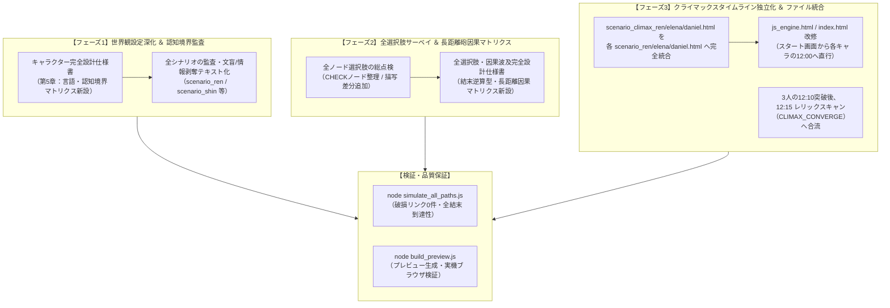

# 『パラレル・ジャパニア：クロニクル』シナリオ・因果・構造抜本リファクタリング計画書

**策定日**: 2026年9月9日  
**対象領域**: 世界観設定資料 / 全選択肢因果マトリクス / クライマックス構造 ＆ 全シナリオファイル  
**ステータス**: 実行承認待ち

---

## 1. 背景と根本課題

本作が「単なる公民教材ノベル」を超え、428型サウンドノベルの真髄（極上のサスペンス、バタフライ・エフェクト、能動的な推理体験）を完全体得した傑作となるために、以下の3つの根本的課題を抜本的に解決する。

### 課題1：世界観・認知境界の綻び（「学校」発言等のメタ視点バグ）
* **現状**: スラム孤児レンが「普通に学校に通って学ぶ機会すら奪われ」と発言するなど、近代市民社会の公教育や公民教科書の知識がキャラクターの一人称に漏れ出ている。
* **本質**: ディストピアの真の恐怖は「学校に行けないこと」ではなく、「文字を奪われ、世界の仕組みや教育・人権という概念そのものを知らされずに家畜として使い潰されること」。設定資料に階層ごとの情報流通・認識論の厳密な規定が不足していた。

### 課題2：無意味な選択肢（チョイス・イリュージョン）と近距離因果の限界
* **現状**: CHECKノード（他シナリオ判定）でどちらを押しても同じ判定を行うだけのダミー二者択一や、選んだ直後に全く同一の文章に合流する選択肢が散見される。
* **本質**: また、現在の因果波及は同時間帯（10:15の行動が10:30に影響）の近距離砲が中心で、428の真骨頂である「序盤（10:00）の些細な行動が、終盤（11:45や12:00）で思いもよらぬ形で炸裂する長距離砲バタフライエフェクト」が不足している。

### 課題3：クライマックスのナラティブ断絶（イベント内キャラ選択の矛盾）
* **現状**: 12:00に入った瞬間、画面上の主人公選択ではなく、シナリオ本文内の選択肢で「レン視点 / エレナ視点 / ダニエル視点」を選ばせている（`CLIMAX_HUB`）。
* **本質**: プレイヤーは「さっきまでキャラ選択UIで切り替えていたのに、急に神視点になって選択肢で選ばされる」という強い違和感を抱く。12:00以降も各主人公のタイムライン（レン、エレナ、ダニエル）として独立し、各自の視点から決戦を突破して合流すべきである。

---

## 2. 全体リファクタリング構造概要



---

## 3. 各フェーズの詳細実装設計

### 【フェーズ1】世界観設定資料集の深化 ＆ 認知境界監査

#### 1.1 設定資料集の改訂
* **対象ファイル**: `パラレル・ジャパニア_キャラクター完全設計仕様書.md`
* **追加セクション**: 「第5章：階層別言語・情報流通・認識論マトリクス（認知境界の厳格規定）」
  * **地下スラム（レン・シン）**:
    * 統治当局による徹底的な「文盲・無知化政策」。文字が読めると反乱の火種となるため、文字教育は重罪として禁じられている。
    * レンは「学校」「公民」「人権」「憲法」という言葉・制度自体を知らない。
    * レンが知っている現実：「配給のグラム数」「識別札の番号」「看守の怒号」「廃棄処分」「壁の警告文が読めずに毒ガスで死んだ仲間」「文字が読めないせいで騙し取られる食糧」。
    * 「教育を受ける権利（憲法第26条）」とは、学校に通うことではなく**「文字と知識を奪われ、世界の仕組みを知らされずに一生を道具として使い潰される理不尽への怒り」**として逆照射する。
  * **中層労働区（ダニエル・エマ）**:
    * 旧時代の医学書や技術書を隠し持っているが、当局から「危険思想・邪教」として焚書・検閲されている。
  * **上層特権街（エレナ・オーガスト）**:
    * 高度な帝王学と法知識を叩き込まれているが、「日本国憲法」や「基本的人権」は歴史から抹消され、「弱者を管理・間引くことが秩序」とする歪んだ統治論を教えられている。

#### 1.2 シナリオテキストの修正
* `scenario_ren.html` (A_1000):
  * **旧**: `生まれつきの血統を理由に、<span class='tip-link' data-tip='教育を受ける権利'>普通に学校に通って学ぶ機会</span>すら奪われ、この薄暗い底辺で使い捨ての歯車として扱われてきた。`
  * **新**: `生まれつきの血統を理由に、文字の読み書きすら教わらず、壁の警告表示すら読めねえ。上の世界の連中が嗜むっていう学問なんて高尚なもんとは無縁で、生まれた時から鉄屑の削り方と弾薬の詰め方だけを叩き込まれ、<span class='tip-link' data-tip='教育を受ける権利'>学ぶ機会や知識</span>を奪われて使い捨ての歯車として扱われてきた。`
* `scenario_shin.html` (SHIN_01):
  * **旧**: `学校にも行けず文字すら奪われていたオレたちに……`
  * **新**: `文字の読み書きすら教わらず、鉄屑の重さしか知らなかったオレたちに、<span class='tip-link' data-tip='教育を受ける権利'>学ぶことの尊さと生きる力</span>を教えてくれた。`

---

### 【フェーズ2】全選択肢サーベイ ＆ 「長距離砲バタフライエフェクト」因果逆算マトリクス

#### 2.1 全選択肢サーベイと無意味な選択肢の排除
1. **CHECKノードの二者択一の整理**:
   * `A_1130_CHECK_DANIEL`: どちらを選んでも `checkJump(C_1110)` だったものを、単一の明確なアクション（「街頭ビジョンの回線を強制接続し、全画面へ映像を流す！」）に純化、または行動に応じたテキスト差分を付与。
   * `A_1145_CHECK_BOOMERANG`: どちらを選んでも `checkJump(A_1015)` だったものを、単一の決断（「激痛に耐え、東管制室へ最後の疾走を開始する！」）へ整理。
   * `B_1015_CHECK_REN`, `B_1145_CHECK_DANIEL`, `B_1145_CHECK_SURRENDER` も同様に整理。
2. **即時合流ノードの描写差分（フィードバック）の導入**:
   * `A_1000`（レンチ一撃 vs マイク偽装）:
     * 次の `A_1015` の冒頭に `function(state)` を追加。
     * レンチを選んだ場合：「静まり返った工場に響き渡った破砕音のせいで、防衛ドローンが即座に急行してくる……！」
     * マイクを選んだ場合：「構内は虚偽のガス警報で阿鼻叫喚だ。パニックに逃げ惑う作業員の群れを盾にしながら……！」
     * これにより、「自分の選んだ行動が状況に反映されている」確かな手応えを与える。

#### 2.2 長距離砲バタフライエフェクト因果逆算マトリクスの策定
* **対象ファイル**: `パラレル・ジャパニア_全選択肢・因果波及完全設計仕様書.md`
* **新設章**: 「第11章：結末逆算型・長距離砲バタフライエフェクト完全マトリクス」
* **長距離因果の連鎖構造**:

| 発動元（序盤〜中盤） | 選択行動 | スロット/フラグ | 着弾先（終盤〜クライマックス） | 直撃する影響・バタフライエフェクト |
| :--- | :--- | :--- | :--- | :--- |
| **レン 10:15** | 排気ダクト破壊（粉塵放出） | `A_SMOKE` | **ダニエル 11:45** | 1時間半後、中央タワー換気シャフト経由で南翼生命インフラに煙が到達。警備ドローンの光学センサーを狂わせ、ダニエルが安全にコンソールへ接近できる。 |
| **エレナ 10:30** | 水門の安全開放 | `B_OPEN_GATE` | **レン 12:00** | 下層放水路の水位が低下。12:00にレンがタワー東翼の非常排気ハッチへ取り付く際の足場が水没せず確保される。 |
| **ダニエル 10:00** | 負傷した警備兵を無償治療 | `C_HEAL` | **エレナ 11:50** | 治療を受けた警備兵が西管制室の警備に就いており、エレナを発見するも見逃す（「……行け、お嬢さん」）。（※拒絶していた場合はBAD ENDまたは戦闘KEEP OUT） |
| **エレナ 11:00** | 巡回シフト表の取得 | `B_TAKE_SCHEDULE` | **ダニエル 12:05** | エレナがタワー内に落とした巡回表をダニエルが拾い、南翼生命維持室の防衛レーザー周期を看破できる。 |

---

### 【フェーズ3】クライマックスのキャラクタータイムライン独立化 ＆ ファイル構造リファクタリング

#### 3.1 ファイル構造の再編（各主人公ファイルへの統合）
* **ファイルの再編方針**:
  * `scenario_climax_ren.html` の全ノード（`CLIMAX_REN_START` 〜 `CLIMAX_REN_CONSOLE` 等）を `scenario_ren.html` の末尾へ完全統合。
  * `scenario_climax_elena.html` の全ノードを `scenario_elena.html` の末尾へ完全統合。
  * `scenario_climax_daniel.html` の全ノードを `scenario_daniel.html` の末尾へ完全統合。
  * `scenario_climax.html` は、3人が12:10に各管制室を突破した後の**「12:15 合流・古遺物スキャン（CLIMAX_CONVERGE_HUB / CLIMAX_SCAN / CLIMAX_DECISION）および全結末・BAD END」専用ファイル**として再定義。
  * 不要となった `scenario_climax_ren.html` 等の単体ファイルは整理（または統合済みコメント化）。

#### 3.2 ゲームエンジンとUIの改修
* **`js_engine.html`**:
  * `launchNode` およびスタート画面（`viewAuth`）の挙動を修正。
  * Hour 2（11:50）をクリアした際、変則的な「3人合同カード」を出すのではなく、**スタート画面の各キャラクターカード（レン、エレナ、ダニエル）の12:00をアンロック**する。
  * レンを押せば `CLIMAX_REN_START`（レンの12:00 東翼決戦）へ直行。
  * エレナを押せば `CLIMAX_ELENA_START`（エレナの12:00 西翼決戦）へ直行。
  * ダニエルを押せば `CLIMAX_DANIEL_START`（ダニエルの12:00 南翼決戦）へ直行。
  * 3人全員が12:10の管制室操作を完了すると、自動的に `CLIMAX_CONVERGE_HUB`（12:15 三者同時押し成功・合流ハブ）が発動。
* **`index.html`**:
  * 画面上の `cardClimax`（特別解放カード）を「3人合流（12:15〜）専用カード」とするか、タイムライン進行と一体化させて神視点選択肢を排除。

---

## 4. 検証・品質保証計画

### 4.1 静的パス解析シミュレータの実行
```powershell
node simulate_all_paths.js
```
* **合格基準**:
  * 全ノードの遷移先存在確認：Missing next nodes = 0
  * 全BAD END（BAD_01 〜 BAD_23）への到達可能性：100%
  * 全主人公の12:00ノードから12:15合流ハブへの到達可能性：100%
  * TRUE END（三大基本的人権の調和）への到達可能性：100%

### 4.2 プレビュービルドおよび実機検証
```powershell
node build_preview.js
```
* **ブラウザ実機検証（http://localhost:8080）**:
  1. スタート画面から【レン】を選択 ➔ 10:00のテキストで「学校」などの違和感が解消され、スラムの過酷さが伝わるか。
  2. 選択肢を選んだ際、次の画面で直前の決断を受けた文章が反映されているか。
  3. 11:50クリア後、スタート画面からレン/エレナ/ダニエルの12:00へそれぞれ直接進めるか。
  4. 3人が揃って12:15の古遺物スキャンへ自然に合流するか。

---

## 5. 実行手順（実行順序）

1. **ステップ1**: `パラレル・ジャパニア_キャラクター完全設計仕様書.md` に「第5章：言語・認知境界マトリクス」を追記。
2. **ステップ2**: `scenario_ren.html`, `scenario_shin.html` の世界観違反テキスト（「学校」等）を修正。
3. **ステップ3**: `パラレル・ジャパニア_全選択肢・因果波及完全設計仕様書.md` に「第11章：長距離砲因果マトリクス」を策定。
4. **ステップ4**: シナリオファイルの統合（`scenario_climax_ren/elena/daniel.html` を各主人公ファイルへ統合、`scenario_climax.html` を合流専用へ純化）。
5. **ステップ5**: `js_engine.html` および `index.html` の12:00キャラクター直接進行ロジックの実装。
6. **ステップ6**: 各ノードの選択肢描写差分（即時フィードバック）とCHECKノードの整理を適用。
7. **ステップ7**: `simulate_all_paths.js` による全パス検証 ＆ `build_preview.js` による動作確認。
