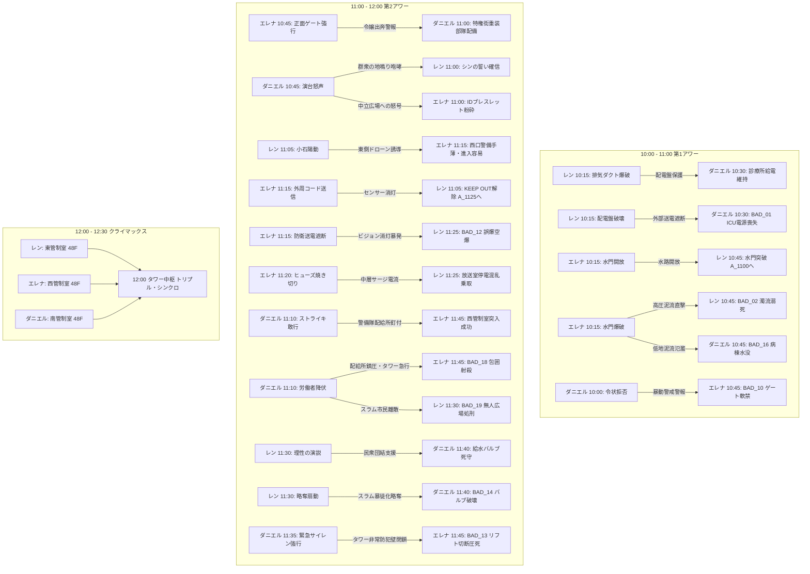

# 『パラレル・ジャパニア：クロニクル』全選択肢・因果波及完全設計仕様書

<document_metadata>
  <title>パラレル・ジャパニア：クロニクル 〜失われた人権の180分〜</title>
  <subtitle>428型因果交錯タイムライン・全選択肢バタフライエフェクト完全マトリクス</subtitle>
  <version>1.0.0</version>
  <status>Official Architecture Specification</status>
  <date>2026-09-05</date>
</document_metadata>

---

## 1. 428型バタフライ・エフェクト設計原則

本作における選択肢は、単なる「その場での主観的行動の分岐」や「ローカルなテキストの変化」にとどまらない。
ある主人公の決断は、都市空間の物理法則（音響伝播・電気配電・水流力学・警備配置）を通じて、**時間差や遠隔地を超えて別の主人公の状況・難易度・心理・生死（BAD END / KEEP OUT）へ波及する「因果の小石（バタフライ・エフェクト）」**として設計される。



---

## 2. 全シナリオ選択肢・因果波及完全マトリクス

### 2.1 シナリオA（レン：自由権）の選択肢と各ルートへの影響

| 時刻・ノード | 選択肢（レンの決断行動） | シナリオA（レン）への影響 | シナリオB（エレナ）への影響 | シナリオC（ダニエル）への影響 |
| :--- | :--- | :--- | :--- | :--- |
| **10:00**<br>`A_1000` | ① 非常用大型レンチで首輪の制御部を一撃で叩き割る！ (`A_BROKE_FORCE`) | 自力で首輪を破壊し、静かに地上検問路地 `A_1015` へ向かう。 | `-`（警報が出ず、エレナは通常通り管理棟へ進める） | `-` |
| **10:00**<br>`A_1000` | ② 構内マイクで「毒ガス発生！全員退避！」と叫んで混乱を起こす！ (`A_PANIC_MIC`) | パニックに乗じて首輪を破壊するが、全区画へ毒ガス警報が誤発報される（`A_1000_MIC` ➔ `A_1015`）。 | **【BAD_11 誘発】** スラム毒ガス誤警報により特権街全域に非常戒厳令が発令。エレナが管理棟前で拘束・自室軟禁される。 | `-` |
| **10:15**<br>`A_1015` | ① 配電盤をショートさせて街路灯を消し、闇に紛れて逃げる (`A_BLACKOUT`) | 闇に紛れて脱出（`A_1030_DARK`）。古遺物（青い泥板）を回収できず、11:45で止血薬不足（BAD_17伏線）。 | `-` | **【BAD_01 誘発】** スラム地下診療所への外部送電が完全遮断。ICUの生命維持装置が停止しレオが心肺停止に陥る。 |
| **10:15**<br>`A_1015` | ② 排気ダクトを破壊し、粉塵爆煙でドローンの赤外線センサーを狂わせる (`A_SMOKE`) | 瓦礫から古遺物【青い泥板（刑事手続記録板・憲法31条）】を発見・回収（真エンド条件 `PIECE_A`）。 | 貴族街の高層テラスに通気ダクトから爆破音と焦げ臭い風が五感ノイズとして届く。 | 配電盤が無傷で守られ、地下診療所の給電が正常維持される（`C_1030_SURVIVE`）。 |
| **10:30**<br>`A_1030` | ① 頑丈そうだ。防弾板として上着の胸元に差し込んで先を急ぐ (`A_TAKE_PLATE`) | 古遺物【青い泥板】を所持（真エンド到達に必須）。 | `-`（12:15合流時に3つの古遺物として共鳴） | `-`（12:15合流時に3つの古遺物として共鳴） |
| **10:30**<br>`A_1030` | ② 余計な荷物は命取りだ。瓦礫を蹴り飛ばし、身軽な体一つで水門へダッシュする (`A_IGNORE_PLATE`) | 古遺物を破棄（通常クリアエンド行き確定）。 | `-` | `-` |
| **10:45**<br>`A_1045` | ① 閉ざされた水門の制御レバーを力任せに引いてみる | エレナの選択（`B_1030`）を照会。正常開放なら脱出（`A_1100`）、爆破ならBAD_02、未操作ならKEEP OUT_A1。 | `-` | `-` |
| **10:45**<br>`A_1045` | ② 水門脇の排水パイプの隙間から脱出できないか強行突破を試みる | エレナの選択（`B_1030`）を照会。正常開放なら脱出（`A_1100`）、爆破ならBAD_02、未操作ならKEEP OUT_A1。 | `-` | `-` |
| **11:00**<br>`A_1100` | ① 検問の死角を突き、高架下の放棄コンテナから警備無線レシーバーを拾って駆け抜ける (`A_HIGHWAY`) | 敵無線の傍受フラグ獲得（`A_TAKE_TRANSCEIVER`）。タワー外周の警備無線の焦燥を察知する。 | `-` | `-` |
| **11:00**<br>`A_1100` | ② 雑居ビルの非常階段を登り、崩れた救護所跡から滅菌包帯と止血薬を拾ってタワー外周へ接近する (`A_ROOFTOP`) | 医療品フラグ獲得（`A_CLEAN_BANDAGE`）。首輪切断創の火照りと出血を応急処置できる。 | `-` | `-` |
| **11:05**<br>`A_1105` | ① センサーの照射周期をじっと監視し、死角を探る (`A_TIMING`) | 息を潜め、レーザーが東へ振れるコンマ数秒の死角を無音で突く（`A_1105_TIMING`）。 | **【東側警戒音なし】** タワー外周のドローンは所定巡回。エレナの11:15進入時に西口に索敵が残る。 | `-` |
| **11:05**<br>`A_1105` | ② ダミーの小石をセンサー網へ投げ込み、反応パターンを試す (`A_PEBBLE`) | 小石を廃ドラム缶へ当て、甲高い金属音でドローンの銃口を一瞬逸らす（`A_1105_PEBBLE`）。 | **【東側陽動】** ドローン群が東側へ急行！ 11:15に西口に着いたエレナの潜入が手薄になり容易に。 | `-` |
| **11:25**<br>`A_1125` | ① 放送室のメインコンソールに直接飛び込み、マイクを握る！ | エレナの選択（`B_1115_NET`）を照会。送電遮断時はBAD_12、正常時は演説準備（`A_1130`）へ。 | `-` | `-` |
| **11:25**<br>`A_1125` | ② 配電盤の外部端子にショートピンを挿し、特区全域の画面を強制同期する！ | エレナの選択（`B_1115_NET`）を照会。送電遮断時はBAD_12、正常時は演説準備（`A_1130`）へ。 | `-` | `-` |
| **11:30**<br>`A_1130` | ① 「恐れるな！ 奪われた自由を取り戻すため理性の声を上げろ！」と叫ぶ (`A_SPEECH_REBEL`) | 理性の演説を行い、全市民が正当な抗議の隊列を組んで立ち上がる。東管制室へ到達可能に。 | `-` | 市民が暴徒化せずダニエルを応援。給水バルブ室を正常死守できる。 |
| **11:30**<br>`A_1130` | ② 「あいつらの物資を奪い取れ！ すべて俺たちのものだ！」と略奪を煽る (`A_SPEECH_RIOT`) | 略奪を扇動し、群衆を暴徒化させる。 | `-` | **【BAD_14 誘発】** 暴徒が配給所を略奪！ ダニエルが守る給水バルブが破壊され患者全滅。 |
| **11:45**<br>`A_1145` | ① 歯を食いしばり、壁に手をついて東管制室へ急ぐ！ | レンの過去選択（`A_1015`）を照会。配電盤破壊（薬品不足）ならBAD_17、煙幕なら東管制室（`A_1150`）へ。 | `-` | `-` |
| **11:45**<br>`A_1145` | ② 首筋を強く押さえ、意識を保ちながら前進する！ | レンの過去選択（`A_1015`）を照会。配電盤破壊（薬品不足）ならBAD_17、煙幕なら東管制室（`A_1150`）へ。 | `-` | `-` |
| **11:50**<br>`A_1150` | ① 東管制端末のスロットにキーを押し込み、トリプル・シンクロを要求する！ (`A_KEY_INSERT`) | `A_FREEDOM_DONE` フラグ獲得。12:00トリプル・シンクロ待機。 | 12:00合流条件の1ピースを満たす。 | 12:00合流条件の1ピースを満たす。 |
| **11:50**<br>`A_1150` | ② 回線を開き「西と南の管制室、誰かいるか！？」と呼びかける！ (`A_CALL_VOICE`) | `A_FREEDOM_DONE` フラグ獲得。12:00トリプル・シンクロ待機。 | 12:00合流条件の1ピースを満たす。 | 12:00合流条件の1ピースを満たす。 |

---

### 2.2 シナリオB（エレナ：平等権）の選択肢と各ルートへの影響

| 時刻・ノード | 選択肢（エレナの決断行動） | シナリオA（レン）への影響 | シナリオB（エレナ）への影響 | シナリオC（ダニエル）への影響 |
| :--- | :--- | :--- | :--- | :--- |
| **10:00**<br>`B_1000` | ① 父の統治端末に侵入し、スラム住民の強制連行データを消去する！ (`B_HACK_LABOR`) | `-` | 屋敷の自室を出て管理棟へ向かう（`B_1015`）。 | `-` |
| **10:00**<br>`B_1000` | ② 屋敷の監視セキュリティをハッキングし、30分間の偽装ループ映像を流す！ (`B_HACK_CAMERA`) | `-` | 屋敷の自室を出て管理棟へ向かう（`B_1015`）。 | `-` |
| **10:15**<br>`B_1015` | ① 水門を一気に開放し、地下水路の水流を安全に逃がす (`B_OPEN_GATE`) | **【水路開放】** 10:45の水門が開き、レンが地上（`A_1100`）へ脱出できる。 | 耐火金庫から古遺物【光学的石板（憲法14条）】を回収（真エンド条件 `PIECE_B`）。 | 地下水路の水位が安定し、低地の診療所への水没被害を防ぐ（`C_1045` へ正常進行）。 |
| **10:15**<br>`B_1015` | ② システムに過負荷をかけて水門を緊急爆破する (`B_BLOW_GATE`) | **【BAD_02 誘発】** 高圧泥流が地下水路を呑み込み、レンが濁流で溺死。 | 水路崩落により **KEEP OUT_B1**（レンの時間軸で因果を書き換えるまで足止め）。 | **【BAD_16 誘発】** 溢れた泥流が地下診療所を襲い、病棟が水没して患者全滅。 |
| **10:30**<br>`B_1030` | ① 表面の幾何学枠……重要な遺物かもしれない。鞄に厳重に収めて脱出する！ (`B_TAKE_PLATE`) | `-`（12:15合流時に3つの古遺物として共鳴） | 古遺物【光学的石板】を所持（真エンド到達に必須）。 | `-`（12:15合流時に3つの古遺物として共鳴） |
| **10:30**<br>`B_1030` | ② かさばる石板は残し、暗号キーが入った小型データチップだけを抜き取って走る！ (`B_IGNORE_PLATE`) | `-` | 古遺物を破棄（通常クリアエンド行き確定）。 | `-` |
| **10:45**<br>`B_1045` | ① 生体IDの通信を敢えて維持し、警備兵の敬礼を受けながら正面ゲートを抜ける！ (`B_GATE_ID`) | `-` | 警備兵の敬礼を受ける特権の屈辱を噛み締めて前進（`B_1045_GATE`）。 | **【配給所へ重装警護隊配備】** 令嬢出奔ログにより、11:00の配給所前に特権街エリート重装隊が増援配備される。 |
| **10:45**<br>`B_1045` | ② IDの追跡電波を完全に切り、壁の排水シャフトを滑り降りて裏道へ抜ける！ (`B_DUCT_STEALTH`) | `-` | 泥水と油煙の暗渠を滑り降り、温室を脱ぎ捨てて脱出（`B_1045_DUCT`）。 | **【配給所は通常警備のみ】** ID途絶で屋敷内捜索となり、配給所は通常警備のみで過剰警戒が回避される。 |
| **11:00**<br>`B_1100` | ① 冷気の吹き出す地下メンテナンス口から、警備員の巡回シフト表を拾ってタワー裏手へ回り込む！ (`B_PATH_DUCT`) | `-` | 巡回シフト表獲得（`B_TAKE_SCHEDULE`）。タワー裏面の警備空白時間を把握。 | `-` |
| **11:00**<br>`B_1100` | ② 労働者用コンテナリフトから、作業員用の難燃性フード付きクロークを羽織って中層へ直行する！ (`B_PATH_LIFT`) | `-` | 難燃性クローク獲得（`B_TAKE_CLOAK`）。赤外線索敵センサーを欺瞞可能に。 | `-` |
| **11:15**<br>`B_1115` | ① 外周センサーの無力化コードを送信し、検問を解除する (`B_CODE_SENT`) | **【検問無力化】** 11:05で足止めされていたレンの目の前でセンサーが消灯し突破可能に（`A_1125` 開放）。 | タワー西側通信デッキへ滑り込む（`B_1120`）。 | `-` |
| **11:15**<br>`B_1115` | ② タワー全体の防衛送電を落とし、センサーごと無力化する (`B_NET_CUT`) | **【BAD_12 誘発】** タワー送電が全遮断！ レンが11:25で街頭ビジョンを使おうとするが画面が真っ暗のまま暴発し市民が空爆される。 | 停電の暗闇の中で管制室へ急ぐ。 | `-` |
| **11:20**<br>`B_1120` | ① 予備ヒューズを焼き切って廊下の照明を落とし、暗闇を駆け抜ける！ (`B_DARK_DASH`) | **【タワー中層サージ電流】** 11:25の街頭ビジョン室で照明が火花を散らし、警備兵がパニックに（`B_1120_FUSE`）。 | 端子盤をショートさせハロゲン灯を爆破。暗黒を疾走。 | `-` |
| **11:20**<br>`B_1120` | ② 通気口の格子を外し、梁の上を静かに伝って管制室へ潜入する！ (`B_CEILING_MOVE`) | 街頭ビジョン室の電気系統は正常。コンソールにクリアな監視映像が映る。 | 天井梁を静かに這い、敵ドローンの頭上を飛び越えて着地（`B_1120_BEAM`）。 | `-` |
| **11:45**<br>`B_1145` | ① 認証スロットのカバーを開け、ただちにトリプル・シンクロ待機に入る！ (`B_FAST_STANDBY`) | 12:00合流条件の1ピースを満たす。 | 西管制室到達フラグ獲得（`B_EQUALITY_DONE`）。12:00トリプル・シンクロ待機。 | 12:00合流条件の1ピースを満たす。 |
| **11:45**<br>`B_1145` | ② 西区画の全カメラにノイズを流し、味方の退路を確保してから待機に入る！ (`B_JAM_CAMERA`) | 12:00合流条件の1ピースを満たす。 | 西管制室到達フラグ獲得（`B_EQUALITY_DONE`）。12:00トリプル・シンクロ待機。 | 12:00合流条件の1ピースを満たす。 |

---

### 2.3 シナリオC（ダニエル：社会権）の選択肢と各ルートへの影響

| 時刻・ノード | 選択肢（ダニエルの決断行動） | シナリオA（レン）への影響 | シナリオB（エレナ）への影響 | シナリオC（ダニエル）への影響 |
| :--- | :--- | :--- | :--- | :--- |
| **10:00**<br>`C_1000` | ① 診療所の予備薬品をすべて警備兵に差し出し、見逃しを請う (`C_BRIBE_POLICE`) | `-` | `-` | 薬品を奪われ、レオの治療薬が尽きる（`C_1015`）。 |
| **10:00**<br>`C_1000` | ② 白衣で立ちはだかり、令状なき診療所への立ち入りを断固拒否する！ (`C_DENY_POLICE`) | `-` | **【BAD_10 誘発】** 警備兵が「スラム医師が暴動扇動」と虚偽無線。特権街ゲートが緊急封鎖されエレナが軟禁。 | 医者の威厳で警備兵を追い払う。 |
| **10:15**<br>`C_1015` | ① 祈る思いで外部電力のメインブレーカーを監視する | `-` | `-` | レンの選択（`A_1015`）を照会。送電遮断ならBAD_01、煙幕なら給電維持（`C_1030_SURVIVE`）。 |
| **10:15**<br>`C_1015` | ② 手動発電クランクのレバーを握りしめ、外部送電の電圧計を見つめる | `-` | `-` | レンの選択（`A_1015`）を照会。送電遮断ならBAD_01、煙幕なら給電維持（`C_1030_SURVIVE`）。 |
| **10:30**<br>`C_1030` | ① 古い刻印……命の遺物だ。肩に担ぎ、薬品補充の直談判へ向かう！ (`C_TAKE_BOX`) | `-`（12:15合流時に3つの古遺物として共鳴） | `-`（12:15合流時に3つの古遺物として共鳴） | 古遺物【白い救護箱（憲法25条）】を所持（真エンド到達に必須 `PIECE_C`）。 |
| **10:30**<br>`C_1030` | ② 救護箱は棚に残し、最小限の応急処置包帯だけをポケットに詰めて広場へ走る！ (`C_IGNORE_BOX`) | `-` | `-` | 古遺物を破棄（通常クリアエンド行き確定）。 |
| **10:45**<br>`C_1045` | ① 広場の演台に立ち「命を諦めるな！ 今こそ団結して要求しよう！」と叫ぶ！ (`C_PODIUM_ROAR`) | **【群衆の地鳴り怒号】** 11:00に水門を出たレンの耳に数百人の叫びが轟き、「みんな戦ってる」と勇気を得る。 | **【中立広場への叫び波及】** 11:00に中立広場に出たエレナに民衆の叫びが届き、ブレスレット粉砕の覚悟を固める。 | 労働者が熱狂し、500人規模の隊列を組んで配給所へ進出（`C_1045_PODIUM`）。 |
| **10:45**<br>`C_1045` | ② 地下工場の班長たちを個別に説得し、組織的な交渉団を結成する！ (`C_LEADER_ORDER`) | 街は不気味な静寂。規則正しい重い足音だけが低く響く。 | 静まり返った街の異様な静けさの中を前進。 | 感情の暴発を抑え、規律ある組織的交渉団として配給所へ進出（`C_1045_LEADER`）。 |
| **11:00**<br>`C_1100` | ① 白衣を風になびかせ、武装警備隊の銃口の正面へ堂々と進み出る！ (`C_APPROACH_FRONT`) | `-` | `-` | 丸腰の医師の威厳に警備隊長が動揺。11:10でゴードンが自ら鉄パイプを落とす（`C_1100_SOLO`）。 |
| **11:00**<br>`C_1100` | ② 労働者全員で腕を組ませ、押し返されない壁を作って対峙する！ (`C_APPROACH_SCRUM`) | **【暴動警報サイレン】** 警備盾列を押し返したことで警備側が危機感を抱き、暴動警報サイレンが鳴り響く。 | **【暴動警報サイレン】** タワー裏面のエレナにも配給所方面の非常サイレン音が届く。 | 盾列を3m押し返す。警備隊が催涙銃を構え極度の緊張に（`C_1100_SCRUM`）。 |
| **11:10**<br>`C_1110` | ① 全員で腕を組み、座り込みストライキを敢行する！ (`C_STRIKE_GO`) | 労働者の団結が守られ、11:30でレンが街頭ビジョン演説を完遂できる。 | 警備部隊が配給所に釘付けになり、11:45でエレナが西管制室へ突入成功。 | 非暴力ストライキで配給所を封鎖し、タワーへ向かう（`C_1135`）。 |
| **11:10**<br>`C_1110` | ② 弾圧を恐れ、労働者たちに解散を促す (`C_SURRENDER`) | **【BAD_19 誘発】** スラム市民が分断・降伏。レンがビジョンを起動しても広場はもぬけの殻で処刑される。 | **【BAD_18 誘発】** 鎮圧を終えた警備隊がタワーへ引き返し、西管制室前のエレナを包囲射殺。 | **【BAD_03 誘発】** 無抵抗で降伏した労働者が首輪で一斉感電処刑される。 |
| **11:35**<br>`C_1135` | ① 救護箱を抱え、警備の目を欺いて地下ダクトを潜り抜ける！ (`C_RUN_SOLO`) | `-` | エレナが乗る中央高速リフトが通常稼働（11:45正常通過）。 | 静かに地下ダクトを抜けて給水室へ向かう（`C_1140`）。 |
| **11:35**<br>`C_1135` | ② サイレンを最大音量で鳴らし、バリケードを強行突破する！ (`C_SIREN_RUSH`) | `-` | **【BAD_13 誘発】** 防犯防壁が緊急閉鎖！ エレナが乗る高速リフトのワイヤーが切断され宙吊り圧死。 | バリケードを突破するが、タワー全体を緊急警戒に陥らせる。 |
| **11:40**<br>`C_1140` | ① 再び閉鎖されないよう、配管の鉄鎖を車輪に巻き付けてロックする！ (`C_LOCK_CHAIN`) | `-` | `-` | スラム全域への給水ラインを物理ロックし、南管制室（`C_1150`）へ。 |
| **11:40**<br>`C_1140` | ② 水圧計の安定を確認し、最上階の南管制室へ駆け上がる！ (`C_RUSH_TOWER`) | `-` | `-` | 水圧計を確認し、南管制室（`C_1150`）へ急行。 |
| **11:50**<br>`C_1150` | ① 南管制スロットにキーを差し込み、トリプル・シンクロを要求する！ (`C_KEY_INSERT`) | 12:00合流条件の1ピースを満たす。 | 12:00合流条件の1ピースを満たす。 | 南管制室到達フラグ獲得（`C_SOCIAL_DONE`）。12:00トリプル・シンクロ待機。 |
| **11:50**<br>`C_1150` | ② 回線を開き「東と西の同志たち、こちらは準備完了だ！」と応答する！ (`C_CALL_VOICE`) | 12:00合流条件の1ピースを満たす。 | 12:00合流条件の1ピースを満たす。 | 南管制室到達フラグ獲得（`C_SOCIAL_DONE`）。12:00トリプル・シンクロ待機。 |

---

## 3. クライマックス（12:00〜12:30）選択肢と結末分岐マトリクス

| 時刻・ノード | 選択肢（3人の合同決断） | 結果・分岐先 | 教育的・劇的影響 |
| :--- | :--- | :--- | :--- |
| **12:00**<br>`CLIMAX_HUB` | ① 三人が持ち寄った古遺物をスキャナのトレイへ並べ、解析を開始する (`START_SCAN`) | ➔ `CLIMAX_SCAN` | 3つのレリックが共鳴。光学スキャンにより叙述トリック（日本国憲法）が解明される正道。 |
| **12:00**<br>`CLIMAX_HUB` | ② 迫る哨戒ドローンの接近音に焦り、三人の認証を待たずに主電源ケーブルを工具で叩き折る！ (`SEVER_CABLE`) | ➔ **BAD_21【逆流した電磁パルス】** | 焦りによる短絡。高圧サージが逆流し、コンソールが爆散して全員失神・拘束される。 |
| **12:15**<br>`CLIMAX_SCAN` | ① タワー統治中枢のシャットダウン最終コンソールを展開する！ | ➔ `CLIMAX_DECISION` | 3箇所同時押し（せーのッ！）の最終意思決定シーケンスへ進出。 |
| **12:15**<br>`CLIMAX_SCAN` | ② 迫る防衛AIのカウントダウンに焦り、緊急停止キーを力任せに連打する！ (`PANIC_AI`) | ➔ **BAD_09【暴走した独裁AI】** | キーの乱打によりセキュリティロックが作動。防衛AIが全都市の首輪を一斉起爆。 |
| **12:15**<br>`CLIMAX_SCAN` | ③ 防衛AIの冷却炉心に飛び込み、過負荷を手動短絡して仲間を守ろうとする！ (`SACRIFICE_CORE`) | ➔ **BAD_20【臨界暴走の殉教】** | 自己犠牲の暴走。炉心の臨界爆発を引き起こし、タワー最上階ごと消滅。 |
| **12:15**<br>`CLIMAX_SCAN` | ④ チャンバー内に充満する防衛催涙ガスを抜くため、非常排気バルブを最大開放する！ (`OPEN_VENT`) | ➔ **BAD_22【毒煙の虐殺パージ】** | バルブ開放により、外気から高濃度の酸性毒煙が逆流し、展望台が窒息死の罠と化す。 |
| **12:15**<br>`CLIMAX_DECISION` | ① 疑念を捨て、仲間の目を見て「せーのッ！」で同時に押し込む！ (`TRUST_ALL`) | ➔ `CLIMAX_RESOLVE` | **【完全停止成功】** 自由権・平等権・社会権の相互信託を確認。電磁首輪が全解除される。 |
| **12:15**<br>`CLIMAX_DECISION` | ② エレナが無言で固まっているのを警戒し、タイミングをコンマ数秒遅らせる (`DOUBT_ELENA`) | ➔ **BAD_06【不信の断絶】** | 0.5秒のズレにより同時認証失敗。防衛レーザーが全員を射殺。 |
| **12:15**<br>`CLIMAX_DECISION` | ③ ダニエルの震える手を不安に思い、呼吸を合わせる前に指を止めてしまう (`DOUBT_DANIEL`) | ➔ **BAD_07【凍結した決断】** | 躊躇によりシステムが侵入者と判定。高圧電流が床一面に放電。 |
| **12:15**<br>`CLIMAX_DECISION` | ④ レンが懐に手を滑り込ませた動作を武器と警戒し、思わず身構えてキーを離す (`DOUBT_REN`) | ➔ **BAD_08【恐怖の躊躇】** | 武器への警戒が命取りとなり、防衛タレットが起動して殲滅される。 |
| **12:15**<br>`CLIMAX_DECISION` | ⑤ コンソールに突然浮かび上がったオーガスト卿のホログラムと対話し、説得を試みる (`TALK_AUGUST`) | ➔ **BAD_23【父祖の道連れトリアージ】** | 対話に応じた隙にオーガスト卿のAIトラップが作動。全員タワー最上階に封印。 |
| **12:30**<br>`ENDING_BRANCH` | ① 結末の刻を迎える（古遺物の収集状況で分岐） | `PIECE_A`, `PIECE_B`, `PIECE_C`<br>全3個所持 ➔ **TRUE_SECRET_END**<br>欠損あり ➔ **NORMAL_CLEAR** | **【TRUE_SECRET_END】** 13:00 東京湾の夜明け、新世紀の日本国憲法（全フラグ回収者のみ）。<br>**【NORMAL_CLEAR】** 12:30 三色の光が照らす朝（通常の首輪解放エンド）。 |

---

## 4. フラグ（`slots` / `userFlags`）連携仕様一覧

```javascript
// ==========================================
// 428型因果連携 スロットおよびフラグマスター定義
// ==========================================
const CAUSALITY_SLOTS = {
  // 第1アワー（10:00〜11:00）
  "A_1000": "A_BROKE_FORCE" | "A_PANIC_MIC",     // レン地下工場脱出法 ➔ B_1015 (BAD_11)
  "A_1015": "A_BLACKOUT" | "A_SMOKE",             // レン検問突破法 ➔ C_1015 (BAD_01), A_1145 (BAD_17)
  "A_1030": "A_TAKE_PLATE" | "A_IGNORE_PLATE",   // レン古遺物（PIECE_A）取得判定
  "B_1000": "B_HACK_LABOR" | "B_HACK_CAMERA",     // エレナ屋敷脱出ハック
  "B_1030": "B_OPEN_GATE" | "B_BLOW_GATE",       // エレナ水門操作 ➔ A_1045 (BAD_02), C_1045 (BAD_16)
  "B_1030_ITEM": "B_TAKE_PLATE" | "B_IGNORE_PLATE", // エレナ古遺物（PIECE_B）取得判定
  "C_1000": "C_BRIBE_POLICE" | "C_DENY_POLICE",   // ダニエル令状対応 ➔ B_1045 (BAD_10)
  "C_1030_ITEM": "C_TAKE_BOX" | "C_IGNORE_BOX",   // ダニエル古遺物（PIECE_C）取得判定

  // 第2アワー（11:00〜12:00）
  "B_1045": "B_GATE_ID" | "B_DUCT_STEALTH",       // エレナ境界壁突破 ➔ C_1100 (重装隊配備波及)
  "C_1045": "C_PODIUM_ROAR" | "C_LEADER_ORDER",   // ダニエル演説法 ➔ A_1100, B_1100 (地鳴り怒号波及)
  "A_1100": "A_HIGHWAY" | "A_ROOFTOP",           // レン進路選択（無線傍受 vs 医療品所持）
  "A_1105": "A_TIMING" | "A_PEBBLE",             // レンセンサー突破 ➔ B_1115 (ドローン東側誘導波及)
  "C_1100": "C_APPROACH_FRONT" | "C_APPROACH_SCRUM", // ダニエル配給所対峙 ➔ C_1110 (警報サイレン鳴動波及)
  "B_1115": "B_CODE_SENT" | "B_NET_CUT",         // エレナ検問解除 ➔ A_1105解除, A_1125 (BAD_12)
  "B_1120": "B_DARK_DASH" | "B_CEILING_MOVE",     // エレナ暗闇突破 ➔ A_1125 (中層サージ停電波及)
  "C_1110": "C_STRIKE_GO" | "C_SURRENDER",       // ダニエルストライキ ➔ A_1130 (BAD_19), B_1145 (BAD_18), C_1110 (BAD_03)
  "A_1130": "A_SPEECH_REBEL" | "A_SPEECH_RIOT",   // レン演説扇動 ➔ C_1140 (BAD_14)
  "C_1135": "C_RUN_SOLO" | "C_SIREN_RUSH",       // ダニエル強行突破 ➔ B_1145 (BAD_13)

  // クライマックス（12:00〜12:30）
  "CLIMAX_HUB_ACTION": "START_SCAN" | "SEVER_CABLE", // ➔ BAD_21
  "CLIMAX_SCAN_ACTION": "PANIC_AI" | "SACRIFICE_CORE" | "OPEN_VENT", // ➔ BAD_09, BAD_20, BAD_22
  "CLIMAX_CHOICE": "TRUST_ALL" | "DOUBT_ELENA" | "DOUBT_DANIEL" | "DOUBT_REN" | "TALK_AUGUST" // ➔ BAD_06, BAD_07, BAD_08, BAD_23
};
```
