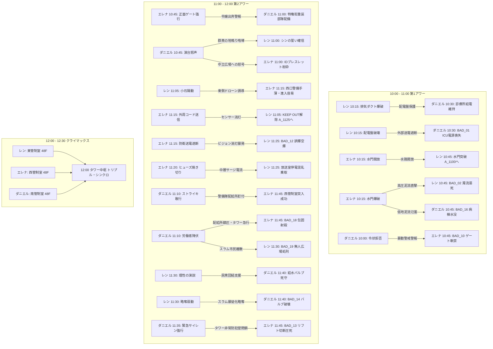
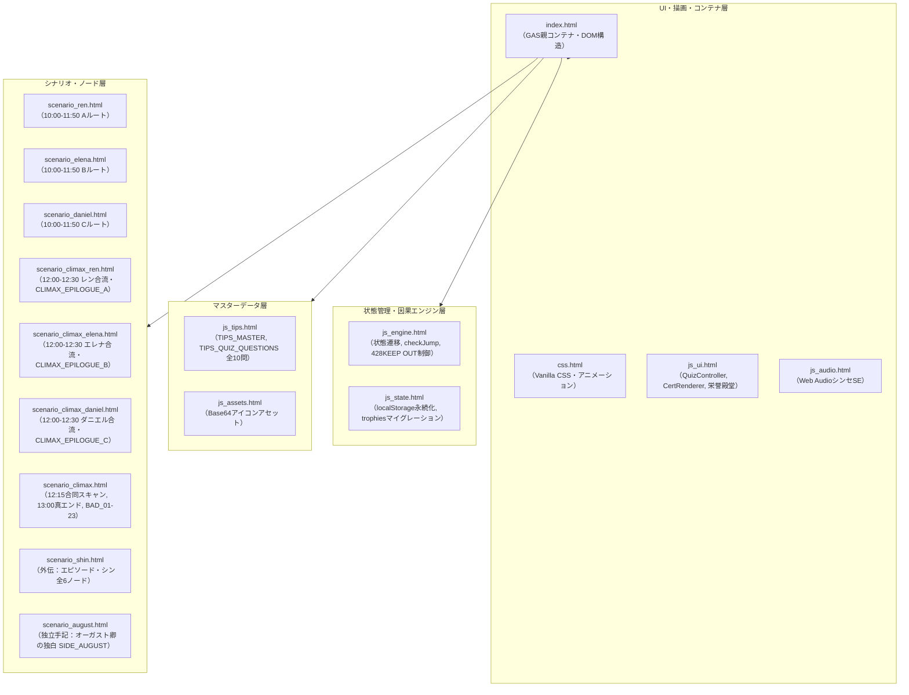

# 『パラレル・ジャパニア：クロニクル』全選択肢・因果波及完全設計仕様書

<document_metadata>
  <title>パラレル・ジャパニア：クロニクル 〜失われた人権の180分〜</title>
  <subtitle>428型因果交錯タイムライン・全選択肢バタフライエフェクト完全マトリクス</subtitle>
  <version>1.4.0</version>
  <status>Official Architecture Specification</status>
  <date>2026-09-08</date>
</document_metadata>

---

## 1. 428型バタフライ・エフェクト設計原則

本作における選択肢は、単なる「その場での主観的行動の分岐」や「ローカルなテキストの変化」にとどまらない。
ある主人公の決断は、都市空間の物理法則（音響伝播・電気配電・水流力学・警備配置）を通じて、**時間差や遠隔地を超えて別の主人公の状況・難易度・心理・生死（BAD END / KEEP OUT）へ波及する「因果の小石（バタフライ・エフェクト）」**として設計される。



---

## 2. 全シナリオ選択肢・因果波及完全マトリクス

### 2.1 シナリオA（レン：自由権）の選択肢と各ルートへの影響

| 時刻・ノード | 選択肢（レンの決断行動） | シナリオA（レン）への影響 | シナリオB（エレナ）への影響 | シナリオC（ダニエル）への影響 |
| :--- | :--- | :--- | :--- | :--- |
| **10:00**<br>`A_1000` | ① 非常用大型レンチで首輪の制御部を一撃で叩き割る！ (`A_BROKE_FORCE`) | 自力で首輪を破壊し、静かに地上検問路地 `A_1015` へ向かう。 | `-`（警報が出ず、エレナは通常通り管理棟へ進める） | `-` |
| **10:00**<br>`A_1000` | ② 構内マイクで「毒ガス発生！全員退避！」と叫んで混乱を起こす！ (`A_PANIC_MIC`) | パニックに乗じて首輪を破壊するが、全区画へ毒ガス警報が誤発報される（`A_1000_MIC` ➔ `A_1015`）。 | **【BAD_11 誘発】** スラム毒ガス誤警報により特権街全域に非常戒厳令が発令。エレナが管理棟前で拘束・自室軟禁される。 | `-` |
| **10:15**<br>`A_1015` | ① 配電盤をショートさせて街路灯を消し、闇に紛れて逃げる (`A_BLACKOUT`) | 闇に紛れて脱出（`A_1030_DARK`）。古遺物（青い泥板）を回収できず、11:45で止血薬不足（BAD_17伏線）。 | `-` | **【BAD_01 誘発】** スラム地下診療所への外部送電が完全遮断。ICUの生命維持装置が停止しレオが心肺停止に陥る。 |
| **10:15**<br>`A_1015` | ② 排気ダクトを破壊し、粉塵爆煙でドローンの赤外線センサーを狂わせる (`A_SMOKE`) | 瓦礫から古遺物【青い泥板（刑事手続記録板・憲法31条）】を発見・回収（真エンド条件 `PIECE_A`）。 | 貴族街の高層テラスに通気ダクトから爆破音と焦げ臭い風が五感ノイズとして届く。 | 配電盤が無傷で守られ、地下診療所の給電が正常維持される（`C_1030_SURVIVE`）。 |
| **10:30**<br>`A_1030` | ① 頑丈そうだ。防弾板として上着の胸元に差し込んで先を急ぐ (`A_TAKE_PLATE`) | 古遺物【青い泥板】を所持（真エンド到達に必須）。 | `-`（12:15合流時に3つの古遺物として共鳴） | `-`（12:15合流時に3つの古遺物として共鳴） |
| **10:30**<br>`A_1030` | ② 余計な荷物は命取りだ。瓦礫を蹴り飛ばし、身軽な体一つで水門へダッシュする (`A_IGNORE_PLATE`) | 古遺物を破棄（通常クリアエンド行き確定）。 | `-` | `-` |
| **10:45**<br>`A_1045` | ① 閉ざされた水門の制御レバーを力任せに引いてみる | エレナの選択（`B_1030`）を照会。正常開放なら脱出（`A_1100`）、爆破ならBAD_02、未操作ならKEEP OUT_A1。 | `-` | `-` |
| **10:45**<br>`A_1045` | ② 水門脇の排水パイプの隙間から脱出できないか強行突破を試みる | エレナの選択（`B_1030`）を照会。正常開放なら脱出（`A_1100`）、爆破ならBAD_02、未操作ならKEEP OUT_A1。 | `-` | `-` |
| **11:00**<br>`A_1100` | ① 検問の死角を突き、高架下の放棄コンテナから警備無線レシーバーを拾って駆け抜ける (`A_HIGHWAY`) | 敵無線の傍受フラグ獲得（`A_TAKE_TRANSCEIVER`）。タワー外周の警備無線の焦燥を察知する。 | `-` | `-` |
| **11:00**<br>`A_1100` | ② 雑居ビルの非常階段を登り、崩れた救護所跡から滅菌包帯と止血薬を拾ってタワー外周へ接近する (`A_ROOFTOP`) | 医療品フラグ獲得（`A_CLEAN_BANDAGE`）。首輪切断創の火照りと出血を応急処置できる。 | `-` | `-` |
| **11:05**<br>`A_1105` | ① センサーの照射周期をじっと監視し、死角を探る (`A_TIMING`) | 息を潜め、レーザーが東へ振れるコンマ数秒の死角を無音で突く（`A_1105_TIMING`）。 | **【東側警戒音なし】** タワー外周のドローンは所定巡回。エレナの11:15進入時に西口に索敵が残る。 | `-` |
| **11:05**<br>`A_1105` | ② ダミーの小石をセンサー網へ投げ込み、反応パターンを試す (`A_PEBBLE`) | 小石を廃ドラム缶へ当て、甲高い金属音でドローンの銃口を一瞬逸らす（`A_1105_PEBBLE`）。 | **【東側陽動】** ドローン群が東側へ急行！ 11:15に西口に着いたエレナの潜入が手薄になり容易に。 | `-` |
| **11:25**<br>`A_1125` | ① 放送室のメインコンソールに直接飛び込み、マイクを握る！ | エレナの選択（`B_1115_NET`）を照会。送電遮断時はBAD_12、正常時は演説準備（`A_1130`）へ。 | `-` | `-` |
| **11:25**<br>`A_1125` | ② 配電盤の外部端子にショートピンを挿し、特区全域の画面を強制同期する！ | エレナの選択（`B_1115_NET`）を照会。送電遮断時はBAD_12、正常時は演説準備（`A_1130`）へ。 | `-` | `-` |
| **11:30**<br>`A_1130` | ① 「恐れるな！ 奪われた自由を取り戻すため理性の声を上げろ！」と叫ぶ (`A_SPEECH_REBEL`) | 理性の演説を行い、全市民が正当な抗議の隊列を組んで立ち上がる。東管制室へ到達可能に。 | `-` | 市民が暴徒化せずダニエルを応援。給水バルブ室を正常死守できる。 |
| **11:30**<br>`A_1130` | ② 「あいつらの物資を奪い取れ！ すべて俺たちのものだ！」と略奪を煽る (`A_SPEECH_RIOT`) | 略奪を扇動し、群衆を暴徒化させる。 | `-` | **【BAD_14 誘発】** 暴徒が配給所を略奪！ ダニエルが守る給水バルブが破壊され患者全滅。 |
| **11:45**<br>`A_1145` | ① 歯を食いしばり、壁に手をついて東管制室へ急ぐ！ | レンの過去選択（`A_1015`）を照会。配電盤破壊（薬品不足）ならBAD_17、煙幕なら東管制室（`A_1150`）へ。 | `-` | `-` |
| **11:45**<br>`A_1145` | ② 首筋を強く押さえ、意識を保ちながら前進する！ | レンの過去選択（`A_1015`）を照会。配電盤破壊（薬品不足）ならBAD_17、煙幕なら東管制室（`A_1150`）へ。 | `-` | `-` |
| **11:50**<br>`A_1150` | ① 東管制端末のスロットにキーを押し込み、トリプル・シンクロを要求する！ (`A_KEY_INSERT`) | `A_FREEDOM_DONE` フラグ獲得。12:00トリプル・シンクロ待機。 | 12:00合流条件の1ピースを満たす。 | 12:00合流条件の1ピースを満たす。 |
| **11:50**<br>`A_1150` | ② 回線を開き「西と南の管制室、誰かいるか！？」と呼びかける！ (`A_CALL_VOICE`) | `A_FREEDOM_DONE` フラグ獲得。12:00トリプル・シンクロ待機。 | 12:00合流条件の1ピースを満たす。 | 12:00合流条件の1ピースを満たす。 |

---

### 2.2 シナリオB（エレナ：平等権）の選択肢と各ルートへの影響

| 時刻・ノード | 選択肢（エレナの決断行動） | シナリオA（レン）への影響 | シナリオB（エレナ）への影響 | シナリオC（ダニエル）への影響 |
| :--- | :--- | :--- | :--- | :--- |
| **10:00**<br>`B_1000` | ① 父の統治端末に侵入し、スラム住民の強制連行データを消去する！ (`B_HACK_LABOR`) | `-` | 屋敷の自室を出て管理棟へ向かう（`B_1015`）。 | `-` |
| **10:00**<br>`B_1000` | ② 屋敷の監視セキュリティをハッキングし、30分間の偽装ループ映像を流す！ (`B_HACK_CAMERA`) | `-` | 屋敷の自室を出て管理棟へ向かう（`B_1015`）。 | `-` |
| **10:15**<br>`B_1015` | ① 水門を一気に開放し、地下水路の水流を安全に逃がす (`B_OPEN_GATE`) | **【水路開放】** 10:45の水門が開き、レンが地上（`A_1100`）へ脱出できる。 | 耐火金庫から古遺物【光学的石板（憲法14条）】を回収（真エンド条件 `PIECE_B`）。 | 地下水路の水位が安定し、低地の診療所への水没被害を防ぐ（`C_1045` へ正常進行）。 |
| **10:15**<br>`B_1015` | ② システムに過負荷をかけて水門を緊急爆破する (`B_BLOW_GATE`) | **【BAD_02 誘発】** 高圧泥流が地下水路を呑み込み、レンが濁流で溺死。 | 水路崩落により **KEEP OUT_B1**（レンの時間軸で因果を書き換えるまで足止め）。 | **【BAD_16 誘発】** 溢れた泥流が地下診療所を襲い、病棟が水没して患者全滅。 |
| **10:30**<br>`B_1030` | ① 表面の幾何学枠……重要な遺物かもしれない。鞄に厳重に収めて脱出する！ (`B_TAKE_PLATE`) | `-`（12:15合流時に3つの古遺物として共鳴） | 古遺物【光学的石板】を所持（真エンド到達に必須）。 | `-`（12:15合流時に3つの古遺物として共鳴） |
| **10:30**<br>`B_1030` | ② かさばる石板は残し、暗号キーが入った小型データチップだけを抜き取って走る！ (`B_IGNORE_PLATE`) | `-` | 古遺物を破棄（通常クリアエンド行き確定）。 | `-` |
| **10:45**<br>`B_1045` | ① 生体IDの通信を敢えて維持し、警備兵の敬礼を受けながら正面ゲートを抜ける！ (`B_GATE_ID`) | `-` | 警備兵の敬礼を受ける特権の屈辱を噛み締めて前進（`B_1045_GATE`）。 | **【配給所へ重装警護隊配備】** 令嬢出奔ログにより、11:00の配給所前に特権街エリート重装隊が増援配備される。 |
| **10:45**<br>`B_1045` | ② IDの追跡電波を完全に切り、壁の排水シャフトを滑り降りて裏道へ抜ける！ (`B_DUCT_STEALTH`) | `-` | 泥水と油煙の暗渠を滑り降り、温室を脱ぎ捨てて脱出（`B_1045_DUCT`）。 | **【配給所は通常警備のみ】** ID途絶で屋敷内捜索となり、配給所は通常警備のみで過剰警戒が回避される。 |
| **11:00**<br>`B_1100` | ① 冷気の吹き出す地下メンテナンス口から、警備員の巡回シフト表を拾ってタワー裏手へ回り込む！ (`B_PATH_DUCT`) | `-` | 巡回シフト表獲得（`B_TAKE_SCHEDULE`）。タワー裏面の警備空白時間を把握。 | `-` |
| **11:00**<br>`B_1100` | ② 労働者用コンテナリフトから、作業員用の難燃性フード付きクロークを羽織って中層へ直行する！ (`B_PATH_LIFT`) | `-` | 難燃性クローク獲得（`B_TAKE_CLOAK`）。赤外線索敵センサーを欺瞞可能に。 | `-` |
| **11:15**<br>`B_1115` | ① 外周センサーの無力化コードを送信し、検問を解除する (`B_CODE_SENT`) | **【検問無力化】** 11:05で足止めされていたレンの目の前でセンサーが消灯し突破可能に（`A_1125` 開放）。 | タワー西側通信デッキへ滑り込む（`B_1120`）。 | `-` |
| **11:15**<br>`B_1115` | ② タワー全体の防衛送電を落とし、センサーごと無力化する (`B_NET_CUT`) | **【BAD_12 誘発】** タワー送電が全遮断！ レンが11:25で街頭ビジョンを使おうとするが画面が真っ暗のまま暴発し市民が空爆される。 | 停電の暗闇の中で管制室へ急ぐ。 | `-` |
| **11:20**<br>`B_1120` | ① 予備ヒューズを焼き切って廊下の照明を落とし、暗闇を駆け抜ける！ (`B_DARK_DASH`) | **【タワー中層サージ電流】** 11:25の街頭ビジョン室で照明が火花を散らし、警備兵がパニックに（`B_1120_FUSE`）。 | 端子盤をショートさせハロゲン灯を爆破。暗黒を疾走。 | `-` |
| **11:20**<br>`B_1120` | ② 通気口の格子を外し、梁の上を静かに伝って管制室へ潜入する！ (`B_CEILING_MOVE`) | 街頭ビジョン室の電気系統は正常。コンソールにクリアな監視映像が映る。 | 天井梁を静かに這い、敵ドローンの頭上を飛び越えて着地（`B_1120_BEAM`）。 | `-` |
| **11:45**<br>`B_1145` | ① 認証スロットのカバーを開け、ただちにトリプル・シンクロ待機に入る！ (`B_FAST_STANDBY`) | 12:00合流条件の1ピースを満たす。 | 西管制室到達フラグ獲得（`B_EQUALITY_DONE`）。12:00トリプル・シンクロ待機。 | 12:00合流条件の1ピースを満たす。 |
| **11:45**<br>`B_1145` | ② 西区画の全カメラにノイズを流し、味方の退路を確保してから待機に入る！ (`B_JAM_CAMERA`) | 12:00合流条件の1ピースを満たす。 | 西管制室到達フラグ獲得（`B_EQUALITY_DONE`）。12:00トリプル・シンクロ待機。 | 12:00合流条件の1ピースを満たす。 |

---

### 2.3 シナリオC（ダニエル：社会権）の選択肢と各ルートへの影響

| 時刻・ノード | 選択肢（ダニエルの決断行動） | シナリオA（レン）への影響 | シナリオB（エレナ）への影響 | シナリオC（ダニエル）への影響 |
| :--- | :--- | :--- | :--- | :--- |
| **10:00**<br>`C_1000` | ① 診療所の予備薬品をすべて警備兵に差し出し、見逃しを請う (`C_BRIBE_POLICE`) | `-` | `-` | 薬品を奪われ、レオの治療薬が尽きる（`C_1015`）。 |
| **10:00**<br>`C_1000` | ② 白衣で立ちはだかり、令状なき診療所への立ち入りを断固拒否する！ (`C_DENY_POLICE`) | `-` | **【BAD_10 誘発】** 警備兵が「スラム医師が暴動扇動」と虚偽無線。特権街ゲートが緊急封鎖されエレナが軟禁。 | 医者の威厳で警備兵を追い払う。 |
| **10:15**<br>`C_1015` | ① 祈る思いで外部電力のメインブレーカーを監視する | `-` | `-` | レンの選択（`A_1015`）を照会。送電遮断ならBAD_01、煙幕なら給電維持（`C_1030_SURVIVE`）。 |
| **10:15**<br>`C_1015` | ② 手動発電クランクのレバーを握りしめ、外部送電の電圧計を見つめる | `-` | `-` | レンの選択（`A_1015`）を照会。送電遮断ならBAD_01、煙幕なら給電維持（`C_1030_SURVIVE`）。 |
| **10:30**<br>`C_1030` | ① 古い刻印……命の遺物だ。肩に担ぎ、薬品補充の直談判へ向かう！ (`C_TAKE_BOX`) | `-`（12:15合流時に3つの古遺物として共鳴） | `-`（12:15合流時に3つの古遺物として共鳴） | 古遺物【白い救護箱（憲法25条）】を所持（真エンド到達に必須 `PIECE_C`）。 |
| **10:30**<br>`C_1030` | ② 救護箱は棚に残し、最小限の応急処置包帯だけをポケットに詰めて広場へ走る！ (`C_IGNORE_BOX`) | `-` | `-` | 古遺物を破棄（通常クリアエンド行き確定）。 |
| **10:45**<br>`C_1045` | ① 広場の演台に立ち「命を諦めるな！ 今こそ団結して要求しよう！」と叫ぶ！ (`C_PODIUM_ROAR`) | **【群衆の地鳴り怒号】** 11:00に水門を出たレンの耳に数百人の叫びが轟き、「みんな戦ってる」と勇気を得る。 | **【中立広場への叫び波及】** 11:00に中立広場に出たエレナに民衆の叫びが届き、ブレスレット粉砕の覚悟を固める。 | 労働者が熱狂し、500人規模の隊列を組んで配給所へ進出（`C_1045_PODIUM`）。 |
| **10:45**<br>`C_1045` | ② 地下工場の班長たちを個別に説得し、組織的な交渉団を結成する！ (`C_LEADER_ORDER`) | 街は不気味な静寂。規則正しい重い足音だけが低く響く。 | 静まり返った街の異様な静けさの中を前進。 | 感情の暴発を抑え、規律ある組織的交渉団として配給所へ進出（`C_1045_LEADER`）。 |
| **11:00**<br>`C_1100` | ① 白衣を風になびかせ、武装警備隊の銃口の正面へ堂々と進み出る！ (`C_APPROACH_FRONT`) | `-` | `-` | 丸腰の医師の威厳に警備隊長が動揺。11:10でゴードンが自ら鉄パイプを落とす（`C_1100_SOLO`）。 |
| **11:00**<br>`C_1100` | ② 労働者全員で腕を組ませ、押し返されない壁を作って対峙する！ (`C_APPROACH_SCRUM`) | **【暴動警報サイレン】** 警備盾列を押し返したことで警備側が危機感を抱き、暴動警報サイレンが鳴り響く。 | **【暴動警報サイレン】** タワー裏面のエレナにも配給所方面の非常サイレン音が届く。 | 盾列を3m押し返す。警備隊が催涙銃を構え極度の緊張に（`C_1100_SCRUM`）。 |
| **11:10**<br>`C_1110` | ① 全員で腕を組み、座り込みストライキを敢行する！ (`C_STRIKE_GO`) | 労働者の団結が守られ、11:30でレンが街頭ビジョン演説を完遂できる。 | 警備部隊が配給所に釘付けになり、11:45でエレナが西管制室へ突入成功。 | 非暴力ストライキで配給所を封鎖し、タワーへ向かう（`C_1135`）。 |
| **11:10**<br>`C_1110` | ② 弾圧を恐れ、労働者たちに解散を促す (`C_SURRENDER`) | **【BAD_19 誘発】** スラム市民が分断・降伏。レンがビジョンを起動しても広場はもぬけの殻で処刑される。 | **【BAD_18 誘発】** 鎮圧を終えた警備隊がタワーへ引き返し、西管制室前のエレナを包囲射殺。 | **【BAD_03 誘発】** 無抵抗で降伏した労働者が首輪で一斉感電処刑される。 |
| **11:35**<br>`C_1135` | ① 救護箱を抱え、警備の目を欺いて地下ダクトを潜り抜ける！ (`C_RUN_SOLO`) | `-` | エレナが乗る中央高速リフトが通常稼働（11:45正常通過）。 | 静かに地下ダクトを抜けて給水室へ向かう（`C_1140`）。 |
| **11:35**<br>`C_1135` | ② サイレンを最大音量で鳴らし、バリケードを強行突破する！ (`C_SIREN_RUSH`) | `-` | **【BAD_13 誘発】** 防犯防壁が緊急閉鎖！ エレナが乗る高速リフトのワイヤーが切断され宙吊り圧死。 | バリケードを突破するが、タワー全体を緊急警戒に陥らせる。 |
| **11:40**<br>`C_1140` | ① 再び閉鎖されないよう、配管の鉄鎖を車輪に巻き付けてロックする！ (`C_LOCK_CHAIN`) | `-` | `-` | スラム全域への給水ラインを物理ロックし、南管制室（`C_1150`）へ。 |
| **11:40**<br>`C_1140` | ② 水圧計の安定を確認し、最上階の南管制室へ駆け上がる！ (`C_RUSH_TOWER`) | `-` | `-` | 水圧計を確認し、南管制室（`C_1150`）へ急行。 |
| **11:50**<br>`C_1150` | ① 南管制スロットにキーを差し込み、トリプル・シンクロを要求する！ (`C_KEY_INSERT`) | 12:00合流条件の1ピースを満たす。 | 12:00合流条件の1ピースを満たす。 | 南管制室到達フラグ獲得（`C_SOCIAL_DONE`）。12:00トリプル・シンクロ待機。 |
| **11:50**<br>`C_1150` | ② 回線を開き「東と西の同志たち、こちらは準備完了だ！」と応答する！ (`C_CALL_VOICE`) | 12:00合流条件の1ピースを満たす。 | 12:00合流条件の1ピースを満たす。 | 南管制室到達フラグ獲得（`C_SOCIAL_DONE`）。12:00トリプル・シンクロ待機。 |

---

## 3. クライマックス（12:00〜12:30）選択肢と結末分岐マトリクス

| 時刻・ノード | 選択肢（3人の合同決断） | 結果・分岐先 | 教育的・劇的影響 |
| :--- | :--- | :--- | :--- |
| **12:00**<br>`CLIMAX_HUB` | ① 三人が持ち寄った古遺物をスキャナのトレイへ並べ、解析を開始する (`START_SCAN`) | ➔ `CLIMAX_SCAN` | 3つのレリックが共鳴。光学スキャンにより叙述トリック（日本国憲法）が解明される正道。 |
| **12:00**<br>`CLIMAX_HUB` | ② 迫る哨戒ドローンの接近音に焦り、三人の認証を待たずに主電源ケーブルを工具で叩き折る！ (`SEVER_CABLE`) | ➔ **BAD_21【逆流した電磁パルス】** | 焦りによる短絡。高圧サージが逆流し、コンソールが爆散して全員失神・拘束される。 |
| **12:15**<br>`CLIMAX_SCAN` | ① タワー統治中枢のシャットダウン最終コンソールを展開する！ | ➔ `CLIMAX_DECISION` | 3箇所同時押し（せーのッ！）の最終意思決定シーケンスへ進出。 |
| **12:15**<br>`CLIMAX_SCAN` | ② 迫る防衛AIのカウントダウンに焦り、緊急停止キーを力任せに連打する！ (`PANIC_AI`) | ➔ **BAD_09【暴走した独裁AI】** | キーの乱打によりセキュリティロックが作動。防衛AIが全都市の首輪を一斉起爆。 |
| **12:15**<br>`CLIMAX_SCAN` | ③ 防衛AIの冷却炉心に飛び込み、過負荷を手動短絡して仲間を守ろうとする！ (`SACRIFICE_CORE`) | ➔ **BAD_20【臨界暴走の殉教】** | 自己犠牲の暴走。炉心の臨界爆発を引き起こし、タワー最上階ごと消滅。 |
| **12:15**<br>`CLIMAX_SCAN` | ④ チャンバー内に充満する防衛催涙ガスを抜くため、非常排気バルブを最大開放する！ (`OPEN_VENT`) | ➔ **BAD_22【毒煙の虐殺パージ】** | バルブ開放により、外気から高濃度の酸性毒煙が逆流し、展望台が窒息死の罠と化す。 |
| **12:15**<br>`CLIMAX_DECISION` | ① 疑念を捨て、仲間の目を見て「せーのッ！」で同時に押し込む！ (`TRUST_ALL`) | ➔ `CLIMAX_RESOLVE` | **【完全停止成功】** 自由権・平等権・社会権の相互信託を確認。電磁首輪が全解除される。 |
| **12:15**<br>`CLIMAX_DECISION` | ② エレナが無言で固まっているのを警戒し、タイミングをコンマ数秒遅らせる (`DOUBT_ELENA`) | ➔ **BAD_06【不信の断絶】** | 0.5秒のズレにより同時認証失敗。防衛レーザーが全員を射殺。 |
| **12:15**<br>`CLIMAX_DECISION` | ③ ダニエルの震える手を不安に思い、呼吸を合わせる前に指を止めてしまう (`DOUBT_DANIEL`) | ➔ **BAD_07【凍結した決断】** | 躊躇によりシステムが侵入者と判定。高圧電流が床一面に放電。 |
| **12:15**<br>`CLIMAX_DECISION` | ④ レンが懐に手を滑り込ませた動作を武器と警戒し、思わず身構えてキーを離す (`DOUBT_REN`) | ➔ **BAD_08【恐怖の躊躇】** | 武器への警戒が命取りとなり、防衛タレットが起動して殲滅される。 |
| **12:15**<br>`CLIMAX_DECISION` | ⑤ コンソールに突然浮かび上がったオーガスト卿のホログラムと対話し、説得を試みる (`TALK_AUGUST`) | ➔ **BAD_23【父祖の道連れトリアージ】** | 対話に応じた隙にオーガスト卿のAIトラップが作動。全員タワー最上階に封印。 |
| **12:30**<br>`ENDING_BRANCH` | ① 結末の刻を迎える（古遺物の収集状況で分岐） | `PIECE_A`, `PIECE_B`, `PIECE_C`<br>全3個所持 ➔ **TRUE_SECRET_END**<br>欠損あり ➔ **NORMAL_CLEAR** | **【TRUE_SECRET_END】** 13:00 東京湾の夜明け、新世紀の日本国憲法（全フラグ回収者のみ）。<br>**【NORMAL_CLEAR】** 12:30 三色の光が照らす朝（通常の首輪解放エンド）。 |

---

## 4. フラグ（`slots` / `userFlags`）連携仕様一覧

```javascript
// ==========================================
// 428型因果連携 スロットおよびフラグマスター定義
// ==========================================
const CAUSALITY_SLOTS = {
  // 第1アワー（10:00〜11:00）
  "A_1000": "A_BROKE_FORCE" | "A_PANIC_MIC",     // レン地下工場脱出法 ➔ B_1015 (BAD_11)
  "A_1015": "A_BLACKOUT" | "A_SMOKE",             // レン検問突破法 ➔ C_1015 (BAD_01), A_1145 (BAD_17)
  "A_1030": "A_TAKE_PLATE" | "A_IGNORE_PLATE",   // レン古遺物（PIECE_A）取得判定
  "B_1000": "B_HACK_LABOR" | "B_HACK_CAMERA",     // エレナ屋敷脱出ハック
  "B_1030": "B_OPEN_GATE" | "B_BLOW_GATE",       // エレナ水門操作 ➔ A_1045 (BAD_02), C_1045 (BAD_16)
  "B_1030_ITEM": "B_TAKE_PLATE" | "B_IGNORE_PLATE", // エレナ古遺物（PIECE_B）取得判定
  "C_1000": "C_BRIBE_POLICE" | "C_DENY_POLICE",   // ダニエル令状対応 ➔ B_1045 (BAD_10)
  "C_1030_ITEM": "C_TAKE_BOX" | "C_IGNORE_BOX",   // ダニエル古遺物（PIECE_C）取得判定

  // 第2アワー（11:00〜12:00）
  "B_1045": "B_GATE_ID" | "B_DUCT_STEALTH",       // エレナ境界壁突破 ➔ C_1100 (重装隊配備波及)
  "C_1045": "C_PODIUM_ROAR" | "C_LEADER_ORDER",   // ダニエル演説法 ➔ A_1100, B_1100 (地鳴り怒号波及)
  "A_1100": "A_HIGHWAY" | "A_ROOFTOP",           // レン進路選択（無線傍受 vs 医療品所持）
  "A_1105": "A_TIMING" | "A_PEBBLE",             // レンセンサー突破 ➔ B_1115 (ドローン東側誘導波及)
  "C_1100": "C_APPROACH_FRONT" | "C_APPROACH_SCRUM", // ダニエル配給所対峙 ➔ C_1110 (警報サイレン鳴動波及)
  "B_1115": "B_CODE_SENT" | "B_NET_CUT",         // エレナ検問解除 ➔ A_1105解除, A_1125 (BAD_12)
  "B_1120": "B_DARK_DASH" | "B_CEILING_MOVE",     // エレナ暗闇突破 ➔ A_1125 (中層サージ停電波及)
  "C_1110": "C_STRIKE_GO" | "C_SURRENDER",       // ダニエルストライキ ➔ A_1130 (BAD_19), B_1145 (BAD_18), C_1110 (BAD_03)
  "A_1130": "A_SPEECH_REBEL" | "A_SPEECH_RIOT",   // レン演説扇動 ➔ C_1140 (BAD_14)
  "C_1135": "C_RUN_SOLO" | "C_SIREN_RUSH",       // ダニエル強行突破 ➔ B_1145 (BAD_13)

  // クライマックス（12:00〜12:30）
  "CLIMAX_HUB_ACTION": "START_SCAN" | "SEVER_CABLE", // ➔ BAD_21
  "CLIMAX_SCAN_ACTION": "PANIC_AI" | "SACRIFICE_CORE" | "OPEN_VENT", // ➔ BAD_09, BAD_20, BAD_22
  "CLIMAX_CHOICE": "TRUST_ALL" | "DOUBT_ELENA" | "DOUBT_DANIEL" | "DOUBT_REN" | "TALK_AUGUST", // ➔ BAD_06, BAD_07, BAD_08, BAD_23

  // エピローグ因果交錯（12:30〜13:00）
  "CLIMAX_EPILOGUE_C": "VOW_DISCRIMINATE" | "VOW_SOLIDARITY", // ダニエル誓い ➔ FLAG_DANIEL_VOW (レンKEEP OUT解除条件1)
  "CLIMAX_EPILOGUE_B": "VOW_PURGE" | "VOW_GUIDE_MARTHA",       // エレナ誓い（案A） ➔ FLAG_ELENA_VOW (レンKEEP OUT解除条件2)
  "CLIMAX_EPILOGUE_A": "VOW_REVENGE" | "VOW_TADAIMA_MOM"       // レン最終決断 ➔ TRUE_SECRET_END
};
```

---

## 5. エピローグ（12:30〜13:00）428型3重KEEP OUT因果交錯と演出仕様

### 5.1 エピローグ因果連携構造
クライマックスで首輪解除に成功した後、各主人公がそれぞれのテーマ（生存権・平等権・自由権）に対する最終的な覚悟（VOW）を選択する。ダニエルとエレナの正しい選択が揃って初めて、レンの最終エピローグの **KEEP OUT** が解除される。

```
【12:20 各主人公のエピローグ選択（因果の連動）】
  ├─ ① ダニエル編エピローグ（第1走者：居場所の獲得）：
  │    [スラムの仲間だけを優先し、特権層の患者を拒絶する] ──➔ KEEP OUT（命の選別の温存）
  │    [仲間たちの元へ駆け寄り、「ただいま！」と笑って全市民の生存権を誓う] ➔ JUMP (FLAG_DANIEL_VOW)
  │
  ├─ ② エレナ編エピローグ（第2走者：血脈の祈りとマーサへの導き）：
  │    [父と貴族たちを報復裁判で処刑する冷酷な道を選ぶ] ────➔ KEEP OUT（法の下の平等の崩壊）
  │    [乳母マーサを見つけ、手を取って息子の元へ導く（案A）] ──➔ JUMP (FLAG_ELENA_VOW)
  │
  │    ┌─────────────────────────────────────────────────────────────┐
  │    │ ★ 428型因果ロック解除：                                     │
  │    │ ダニエル (FLAG_DANIEL_VOW) と エレナ (FLAG_ELENA_VOW) の    │
  │    │ 【両方の選択】が成立した瞬間、レン編の KEEP OUT が解除！   │
  │    └─────────────────────────────────────────────────────────────┘
  │                                     │
  └─ ③ レン編最終エピローグ（アンカー：奇跡の結実）：
       [憎しみに任せ、特権の象徴を焼き払う] ──────────────────➔ KEEP OUT（他者拒絶）
       [母の手を取り、「……ただいま、母さん」と魂を込めて応える] ──➔ TRUE_SECRET_END 達成！
```

### 5.2 『……ただいま、母さん』多重共鳴・映画的演出シークエンス（案A確定稿）
1. **ダニエル**: スラムの仲間（レオ、エマ、ゴードン）に頭を掻きながら照れくさそうに笑って言う。  
   `「……ったく、うるせえ連中だな。……ただいま、だ」`  
   ➔ 離れたレンの心に響く：*（『ただいま』……か。帰る場所があって、迎えてくれる誰かがいる。……いいもんだな）*
2. **エレナ**: 万年筆に触れ亡き父母へ誓い、群衆の端で立ち尽くす乳母マーサの手を取る（案A採用）。  
   `「マーサ……！ 見て……！ あなたが……17年間ずっと……祈り続けていた、あなたの————」`  
   **最後の言葉は、広場に沸き起こった大歓声と勝利の鐘の音にかき消される。** だがマーサの視線の先でレンの真鍮の百合が瞬き、マーサはレンへ駆け出す！
3. **レン**: ダニエルがくれた「ただいま」、エレナがくれた「母さん」、そして目の前のマーサの手の温もり。生まれて17年間一度も口にしたことがなく憧れ続けた言葉が、0.8秒の完全無音・中央単独フェードインで浮かび上がる。  
   $$\huge\text{「……ただいま、母さん」}$$
4. **フィナーレ**: マーサがレンを抱きしめ、ダニエルとエレナが微笑み、新世紀の東京湾の朝陽が四人を包み込み、13:00 TRUE_SECRET_END へ進出。

---

## 6. 独立外伝シナリオおよびTIPS動的開示システム

### 6.1 独立外伝モジュール
1. **『外伝：エピソード・シン 〜シンの見た青空〜』(`scenario_shin.html`)**:
   - 解放条件：全23通りのBAD END（BAD_01〜BAD_23）を完全踏破。
   - 内容：1年前に親友レンを生かすために命を捧げた少年シンの真実の前日譚（全6ノード）。
   - 読了特典：『探究の鬼 表彰状』授与。
2. **『オーガスト卿の極秘手記』(`scenario_august.html`)**:
   - 解放条件：真エンド（13:00 TRUE_SECRET_END）到達後、TIPS「オーガスト卿」からJUMP。
   - 内容：冷酷な暴君の仮面の下で新日本国憲法草案を命がけで温存し続けたオーガスト卿の哀しき独白シナリオ。
   - 読了特典：『真実の編纂者 表彰状』授与。

### 6.2 TIPS動的3段階開示システム（事前ネタバレ完全防止）
本編ディストピアサスペンスの緊張感を守るため、TIPS「オーガスト卿」はクリア状況に応じて動的に進化する：
- **第1段階（未クリア時）**: 統制庁長官・立憲主義の教材としての客観的解説のみ（ネタバレ完全ゼロ）。
- **第2段階（1回クリア時：NORMAL_CLEAR到達後）**: 黄色枠「【極秘記録】オーガスト卿の真実」がアンロック。「10:30の3つの古遺物を集め真エンドに到達せよ」という手引きを開示し、周回モチベーションを創出。
- **第3段階（真エンドクリア時：TRUE_SECRET_END到達後）**: 金色枠【オーガスト卿の極秘手記を読む】JUMPボタンが解放され、`SIDE_AUGUST`（`scenario_august.html`）へ直通。

---

## 7. 憲法マスター検定クイズ全10問と5大栄誉表彰状（トロフィー）システム

### 7.1 憲法マスター検定クイズ（全10問）の出題構造
TIPS全19項目を完全解明することで挑戦権が解放される。単なる用語暗記ではなく、TIPSの以下の3要素から100%論理的に導出される本格検定：
1. **💡 本来言いたいこと（本質・概念理解）**: 自由権（国家からの消極的自由）、社会権（国家による積極的自由）、公共の福祉（権利相互の調和ルール）。
2. **📜 条文（law）（正確な条文正誤）**: 第25条第1項（健康で文化的な最低限度の生活）、第14条第1項（差別禁止条項）、第99条（憲法尊重擁護義務）。
3. **🏛️ 探究判例・歴史の知恵（立憲主義・歴史的意義）**: 検閲の絶対禁止（権力腐敗防止）、華族・貴族制度の永久禁止（門地差別撤廃）。
- **仕様**: 全問正解するまで何度でも再挑戦可能。10問全問正解時に最高位ディプロマが授与される。

### 7.2 5大栄誉表彰状（トロフィー・ディプロマ）一覧

| No | トロフィー名 | 称号 | 解放条件 | 栄誉の核心 |
| :---: | :--- | :--- | :--- | :--- |
| **①** | **『人権調和 表彰状』** | 人権の調和者 | **12:30 NORMAL_CLEAR** | 自由・平等・生存を繋ぎ、破滅を回避した調和の証。 |
| **②** | **『新世紀立憲者 表彰状』** | 新世紀の立憲者 | **13:00 TRUE_SECRET_END** | 3つの古遺物を結集し、新世紀の憲法を打ち立てた偉業の証。 |
| **③** | **『探究の鬼 表彰状』** | 探究の鬼 | **全23BAD END踏破 ＆ エピソード・シン読了** | 23の絶望を見届け、シンの魂を受け継いだ不屈の探究の証。 |
| **④** | **『真実の編纂者 表彰状』** | 真実の編纂者 | **オーガスト卿の極秘手記 読了** | 暴君の仮面の下の真実と、歴史の表裏を看破した見識の証。 |
| **⑤** | **『日本国憲法マスター 修了証書』** | 憲法マスター | **全19TIPS解明 ＆ 検定クイズ全10問全問正解** | 三大基本的人権と立憲主義の真髄を極めた最高峰の証。 |

- **UI仕様**:
  - `CertRenderer` により、高解像度1200×840豪華金枠グラデーション賞状をリアルタイムCanvas描画。
  - タイトル画面およびアーカイブ画面の【🏆 栄誉殿堂】モーダルからいつでも閲覧・A4判PDF/PNG保存可能。未獲得賞状はシルエットと解放条件ヒントを表示。

---

## 8. ファイル別完全実装責任・配置マトリクス（Source Code Allocation Matrix）

「どのファイルに、どのオブジェクト・関数・スロット・DOM・演出を配置するのか」を厳密に定義し、コード修正時の責務曖昧化や重複を完全に排除する。



### 8.1 モジュール別・実装要素完全マッピング表

| レイヤー | 対象ファイル | 担当する具体的実装要素（関数・変数・ノード・DOM） | 責務と制約 |
| :--- | :--- | :--- | :--- |
| **データ** | **`js_tips.html`** | ① `TIPS_MASTER`（全19項目）：オーガスト卿含む初期安全テキスト。<br>② `TIPS_QUIZ_QUESTIONS`（全10問配列）：問題文、選択肢3つ、正解インデックス、詳細解説。 | **UIロジックと問題データを分離**。クイズ文言の修正はこのファイルのみで行う。 |
| **ステート** | **`js_state.html`** | ① `TimelineState.init()`: `state.trophies = state.trophies || {}` の安全マイグレーション。<br>② `unlockTrophy(key)`: 5大トロフィー獲得の永続記録。<br>③ `hasClearedOnce()`, `hasClearedTrueEnd()`: クリア判定API。 | 既存セーブデータ破損を防止し、後方互換性を100%保証する。 |
| **エンジン** | **`js_engine.html`** | ① `checkJump(char, time)`: `CLIMAX_EPILOGUE_A` における `!(FLAG_DANIEL_VOW && FLAG_ELENA_VOW)` のKEEP OUT遮断。<br>② JUMP実行時の未来フラグ安全消去処理。<br>③ 0.8秒無音フェードイン（`tadaima` シークエンス）の演出トリガー。 | 428型因果連携の根幹ロジック。シナリオファイル側に直接if文を書かずエンジン経由で制御。 |
| **UI・演出** | **`js_ui.html`** | ① `QuizController`: 全10問クイズ進行、動的問題数バインド、正誤フィードバック、安全リトライ。<br>② `CertRenderer`: 5大賞状のCanvas 1200×840リアルタイム描画、`document.fonts.ready` 待機、PDF/PNG出力。<br>③ `openTipsModal`: TIPSオーガスト卿の動的3段階UI展開（未クリア／裏面史／手記JUMP）。<br>④ `TrophyGallery`: 5大トロフィー一覧モーダルの描画・プレビュー。 | ユーザーインターフェース・演出の全責任。WebFontロード待ちを必ず保証。 |
| **DOM** | **`index.html`** | ① `#modalQuiz`: クイズモーダル（`<span id="quizTotalCount">10</span>` 等の動的枠組み）。<br>② `#modalTrophyGallery`: 栄誉殿堂（トロフィー図鑑）モーダルDOM。<br>③ タイトル・アーカイブ画面の【🏆 栄誉殿堂】呼び出しボタン。<br>④ `scenario_august` 含む全HTMLモジュールのGASインライン読み込み構文。 | GAS HtmlService の親コンテナ。全モーダルの最上位レイヤー（`z-50`）配置。 |
| **シナリオ** | **`scenario_climax_daniel.html`** | ① `CLIMAX_EPILOGUE_C`: ダニエルエピローグノード。<br>② 選択肢 `VOW_SOLIDARITY`（`FLAG_DANIEL_VOW` 発行）/ `VOW_DISCRIMINATE`（KEEP OUT）。 | ダニエルの肉声（「……ただいま、だ」）と生存権の誓約。 |
| **シナリオ** | **`scenario_climax_elena.html`** | ① `CLIMAX_EPILOGUE_B`: エレナエピローグノード（案A）。<br>② 選択肢 `VOW_GUIDE_MARTHA`（`FLAG_ELENA_VOW` 発行）/ `VOW_PURGE`（KEEP OUT）。 | エレナの告白（歓声にかき消される演出）とマーサへの導き。 |
| **シナリオ** | **`scenario_climax_ren.html`** | ① `CLIMAX_EPILOGUE_A`: レン最終エピローグノード。<br>② 選択肢 `VOW_TADAIMA_MOM`（0.8s無音 ➔ `TRUE_SECRET_END`）/ `VOW_REVENGE`（KEEP OUT）。 | 二人のフラグが揃うことでアンロック。真鍮の百合の共鳴と「ただいま、母さん」。 |
| **外伝** | **`scenario_shin.html`** | `SHIN_01_MEMORY` 〜 `SHIN_06_PROLOGUE_LOOP`（全6ノード）。読了時に `unlockTrophy('shinMaster')`。 | 全23BAD END踏破時のみアンロック。 |
| **外伝** | **`scenario_august.html`** | `SIDE_AUGUST`（全1ノード）。読了時に `unlockTrophy('augustMaster')`。 | 真エンドクリア後、TIPS「オーガスト卿」からJUMP可能。 |
| **検証** | **`simulate_all_paths.js`** | 全シナリオ・TIPSマスター・全選択肢リンク・認知境界（DIR_08）の静的解析エンジン。 | シナリオやロジック変更時は必ず実行し、エラー0件を検証する（`DIR_07`）。 |
| **ビルド** | **`build_preview.js`** | GASインライン結合構文をパースし、`local_preview.html` を出力するローカルビルダー。 | 常に最新の完全結合HTMLを生成・出力する。 |

---

## 9. AIエージェント開発時のアンチパターン＆実装ガイドライン（迷い・事故防止の7大鉄則）

AIエージェント（および開発者）が本プロジェクトを改修・拡張する際、誤認・独断・判断停止に陥りやすい重要トラップを「7大鉄則」として明文化する。

### 9.1 【鉄則1：ノードの所属ファイル厳守】
- `CLIMAX_EPILOGUE_A` ➔ 必ず [scenario_climax_ren.html](file:///c:/Users/佐々木篤史/Desktop/pallarerujapania/scenario_climax_ren.html) に配置する。
- `CLIMAX_EPILOGUE_B` ➔ 必ず [scenario_climax_elena.html](file:///c:/Users/佐々木篤史/Desktop/pallarerujapania/scenario_climax_elena.html) に配置する。
- `CLIMAX_EPILOGUE_C` ➔ 必ず [scenario_climax_daniel.html](file:///c:/Users/佐々木篤史/Desktop/pallarerujapania/scenario_climax_daniel.html) に配置する。
- 合同結末 `NORMAL_CLEAR` および `TRUE_SECRET_END` ➔ 必ず [scenario_climax.html](file:///c:/Users/佐々木篤史/Desktop/pallarerujapania/scenario_climax.html) に配置する。
- **🚨 アンチパターン**: 1つのファイルに全エピローグを統合したり、`scenario_ren.html` 等の10時〜11時台の個別ファイルへ逆流させてノード重複・行方不明を起こすこと。

### 9.2 【鉄則2：クイズマスターデータとUI制御の完全分離】
- 全10問の問題データ配列 `TIPS_QUIZ_QUESTIONS` は、必ず [js_tips.html](file:///c:/Users/佐々木篤史/Desktop/pallarerujapania/js_tips.html) 内にマスターデータとして定義する。
- [js_ui.html](file:///c:/Users/佐々木篤史/Desktop/pallarerujapania/js_ui.html) の `QuizController` は、`TIPS_QUIZ_QUESTIONS` を参照して描画・判定を行う純粋なUIコントローラーとする。
- **🚨 アンチパターン**: `js_ui.html` 内に設問文や選択肢を直接ハードコードして二重管理・仕様乖離を引き起こすこと。

### 9.3 【鉄則3：条文番号秘匿（DIR_03）の適用範囲の境界線】
- **本編テキスト（ノベル本文・選択肢文）**: 10:00〜12:15の古遺物スキャン完了までは、「第25条」「第14条」等の条文番号・法律用語の記載は完全禁止。ただし、12:15スキャン完了以降（12:30〜13:00真エンド）は、解凍された真実として条文番号（第97条・第14条等）を堂々と開示・明記しなければならない。
- **TIPSおよび検定クイズ**: 教育用システム・探究アーカイブであるため、**最初から条文番号・判例名の記載は100%許可**（※ただしTIPS「オーガスト卿」の裏面史のみクリア後アンロック）。
- **🚨 アンチパターン**: 12:15以降のクライマックスや真エンドでも条文番号を伏せ続けてカタルシスを殺したり、逆にTIPS側から条文番号を削ってしまうこと。

### 9.4 【鉄則4：二人称「あなた」禁止（DIR_01）の過剰誤検知の防止】
- 禁止対象は**「読者・プレイヤーに向けたメタ的な語りかけ（地の文・システム文）」**のみ（例：「あなたは扉を開けた」「あなたの進むべき道は？」等）。
- **作中キャラクター同士の自然な会話セリフ**（娘エレナが父を呼ぶ「あなた」、エレナがマーサに語りかける「あなたが祈り続けていた……」、妻が夫を呼ぶ「あなた」等）は、キャラクター表現・人間関係として完全に許容される。
- **🚨 アンチパターン**: 作中人物の自然なセリフまで「DIR_01違反」と機械的に過剰検知し、「お前」や「そなた」等に無理やり書き換えてドラマ性を破壊すること。

### 9.5 【鉄則5：タイムリープ時のフラグゾンビ化防止（未来フラグリセット）】
- プレイヤーが過去のタイムライン（例：10:15）へJUMPして選択肢を変更した場合、未来（例：11:30）で立てられていたフラグが消えずに残る「フラグゾンビ化」を絶対に許してはならない。
- JUMP処理（`jumpToNode` / `checkJump`）実行時は、JUMP先ノードより未来の時間軸のスロットフラグを安全に初期化・パージする仕様を維持すること。
- **🚨 アンチパターン**: フラグを単純に `userFlags[flag] = true` で蓄積し続け、過去を変えたのに未来の成功フラグが生き残って因果が矛盾すること。

### 9.6 【鉄則6：ローカルストレージの後方互換性（未定義安全マイグレーション）】
- `state.trophies` などの新設ステートを扱う際は、既存セーブデータからの復元時に必ず初期化ガードを入れること。
  ```javascript
  state.trophies = state.trophies || {};
  ```
- **🚨 アンチパターン**: `state.trophies.quizMaster` と直接参照し、既存プレイヤーの環境で `TypeError: Cannot read properties of undefined` を発生させてゲーム画面をクラッシュさせること。

### 9.7 【鉄則7：シミュレーター（DIR_07）の完全同期義務】
- 新しい因果スロット（`CLIMAX_EPILOGUE_*` 等）や新ファイル（`scenario_august.html` 等）を追加・変更した際は、必ず [simulate_all_paths.js](file:///c:/Users/佐々木篤史/Desktop/pallarerujapania/simulate_all_paths.js) のスロット定義配列および読み込みリストを同時に更新すること。
- 改修後は必ず `node simulate_all_paths.js`（破損リンク0件・DIR_08違反0件）と `node build_preview.js`（プレビュー生成）を実行し、静的検証を100%パスさせること。
- **🚨 アンチパターン**: コードだけ改修してシミュレーターを放置し、CI/CDや次回実行時にビルドエラーで進行不能になること。

---

## 10. ディストピア人権統治構造とTIPS逆照射完全対照マスター定義（世界観崩壊防止の鉄則）

AIエージェントおよびシナリオ執筆者は、本作品が「人権が徹底的に否定・蹂躙された極限のディストピア」であることを片時も忘れてはならない。
作中ディストピア（ネオ・ジャパニア）において、近代憲法が保障する基本的人権は**「一切認められていない」**か、あるいは**「特権階級の支配道具として歪曲・独占されている」**。
ディストピアの作中人物に近代的な参政権や権利が認められているかのような誤った描写（例：「下層区にも議席がある」「労働組合が合法的に交渉している」等）は、世界観を根本から破壊する致命的アンチパターンである。

| No | 権利・項目名 | 本編ノード | 作中ディストピアでの実態（認められていない／剥奪／歪曲の形態） | TIPS逆照射の教育的意義（作中描写から何を学ぶか） | 🚨 厳禁アンチパターン（ストーリー改変による齟齬防止） |
| :--- | :--- | :--- | :--- | :--- | :--- |
| 1 | **身体の自由** | `A_1015` | **完全剥奪**。令状なしの逮捕、電磁首輪による拷問・遠隔処刑、強制労働。 | 31条（適正手続）、33条・35条（令状主義）、36条（拷問禁止）の重みを逆照射。 | 作中当局が適正な逮捕状を提示したり、容疑者に弁解の機会を与える描写。 |
| 2 | **表現の自由** | `A_1130` | **完全剥奪**。言論の事前検閲、反体制言論の即時処刑、通信統制。 | 21条（表現の自由・検閲の禁止）が権力腐敗を正す唯一の武器であることを逆照射。 | 市民が自由にビラを配ったり、SNSや公の場で当局を批判できる描写。 |
| 3 | **法の下の平等** | `B_1000` | **完全否定**。門地・血統による絶対的身分制（特権貴族 vs 下層民）。 | 14条（門地による差別の撤廃と実質的平等）の理念を逆照射。 | 生まれや血統に関係なく実力で平等に出世できるといった描写。 |
| 4 | **生存権** | `C_1000` | **完全剥奪**。「生産性のない者は死ね」という弱肉強食。医療・薬品配給の意図的断絶。 | 25条（健康で文化的な最低限度の生活）が人間的生存の絶対防壁であることを逆照射。 | 当局が無償の医療福祉や生活保護を公正に配給している描写。 |
| 5 | **労働基本権** | `C_1045` | **完全否定**。16時間強制労働、ストライキは内乱罪として即座に武力鎮圧。 | 27条・28条（労働三権）が対等な労使交渉に不可欠であることを逆照射。 | 当局が労働組合を公認し、平和的に団体交渉に応じる描写。 |
| 6 | **公共の福祉** | `A_1130` | **悪用・歪曲**。当局は「治安維持・秩序」を名目に少数者の切り捨て・虐殺を正当化。 | 12条・13条。真の公共の福祉とは「一人ひとりの尊厳を尊重し合う公平な調和」であることを逆照射。 | 単なる「全体の利益のための個人の犠牲」を美談として肯定する描写。 |
| 7 | **一票の格差** | `B_1115` | **完全剥奪**。下層民には参政権・議席など一切存在しない。特権階級の専制独裁。 | 14条・15条・44条。選ぶ権利すら奪われたディストピアを通じ、一票の平等と主権在民を逆照射。 | **下層区に議席が認められている、下層民が選挙で投票している等の描写（絶対厳禁）**。 |
| 8 | **思想・良心の自由** | `B_1000` | **完全剥奪**。反体制思想の摘発、記憶消去電極による自我リセット（BAD_15）。 | 19条（内心の絶対的自由）が侵されない聖域であることを逆照射。 | 当局が個人の内心の自由や異論を寛容に認めている描写。 |
| 9 | **信教の自由と政教分離** | `C_1000` | **完全否定**。国家統合神殿への礼拝強制と公金支出、その他の宗教・信仰は邪教として弾圧。 | 20条・89条。国家が特定教義を強制・援助することの危険性を逆照射。 | 当局が多様な宗教を公認し、信教の自由を尊重している描写。 |
| 10 | **財産権の保障と制約** | `C_1015` | **完全否定**。私有財産の無断接収、生命線である電力や備蓄薬の略奪。 | 29条（正当な補償なき財産侵害の禁止）を逆照射。 | 当局が接収に対して正当な補償金を支払っている描写。 |
| 11 | **幸福追求権とプライバシー** | `B_1045` | **完全侵害**。生体ドローンによる心拍・私生活の常時スキャン、思考ログ監視。 | 13条（新しい人権・肖像権・プライバシー権）の傘としての機能を逆照射。 | 市民に監視の及ばない私的空間やプライバシーが法的に保障されている描写。 |
| 12 | **知る権利と報道の自由** | `A_1130` | **完全封殺**。歴史の改竄、大本営発表のプロパガンダ放送のみ許可。 | 21条（国民の知る権利とマスメディアの取材の自由）の意義を逆照射。 | 当局が公文書を開示したり、独立した報道機関が存在する描写。 |
| 13 | **教育を受ける権利** | `A_1000`<br>`SHIN_01` | **完全剥奪**。義務教育は存在せず、スラムの孤児は文字も教わらず兵器解体や銃の分解を強いられる。 | 26条（等しく教育を受ける権利・学習権）が人間らしく生きる土台であることを逆照射。 | スラムの子どもたちに公立学校や教育機会が無償で提供されている描写。 |
| 14 | **裁判を受ける権利** | `A_1015` | **完全廃止**。裁判所は解体され、執行官による即決処分・密室での無期限拘禁。 | 32条・37条（司法権の独立・公平かつ迅速な公開裁判）の不可欠性を逆照射。 | 拘束された市民が独立した裁判官による公正な公開裁判を受けられる描写。 |
| 15 | **居住・移転および職業選択の自由** | `A_1100` | **完全統制**。区画間の移動禁止、身分による職業の強制割当、無許可越境は射殺。 | 22条（経済的自由・居住移転の自由）を逆照射。 | 市民が自由に住む場所を選んだり、転職・旅行できる描写。 |
| 16 | **憲法尊重擁護義務** | `B_1150` | **完全無視**。為政者自身が「統治者は法を超越する」と豪語し、法を私物化。 | 99条（立憲主義の本質：国家権力を憲法で縛る）を逆照射。 | オーガスト卿や為政者が憲法を遵守し、自らの権力を抑制している描写。 |
| 17 | **最高法規と永久の信託** | `TRUE_END` | **隠蔽・忘却**。かつて存在した憲法は焼却・封印され、国民の記憶から抹消された。 | 97条・98条。人類が血を流して勝ち取った自由の成果と、最高法規性の重みを解凍する。 | 12:15以前の序盤から市民が日本国憲法を周知している描写（DIR_03違反）。 |
| 18 | **国民主権と三権分立** | `B_1145` | **完全崩壊**。主権は統治総裁オーガスト卿にあり、立法・行政・司法を一元独占。 | 前文・41条・65条・76条（権力の抑制と均衡、主権在民）を逆照射。 | 議会や裁判所が総裁の権力を合法的に弾劾・抑制できる描写。 |
| 19 | **オーガスト卿（裏面史）** | `TIPS`<br>`クリア後` | 過去の非常事態（戦争・恐慌）において「秩序と効率」のために自ら憲法を停止させた男。 | 独裁は悪意からだけでなく、「秩序を求める民衆の委任」からも生まれるという歴史の教訓。 | オーガスト卿が最初から単なる快楽殺人鬼・低俗な悪党として描かれること。 |


