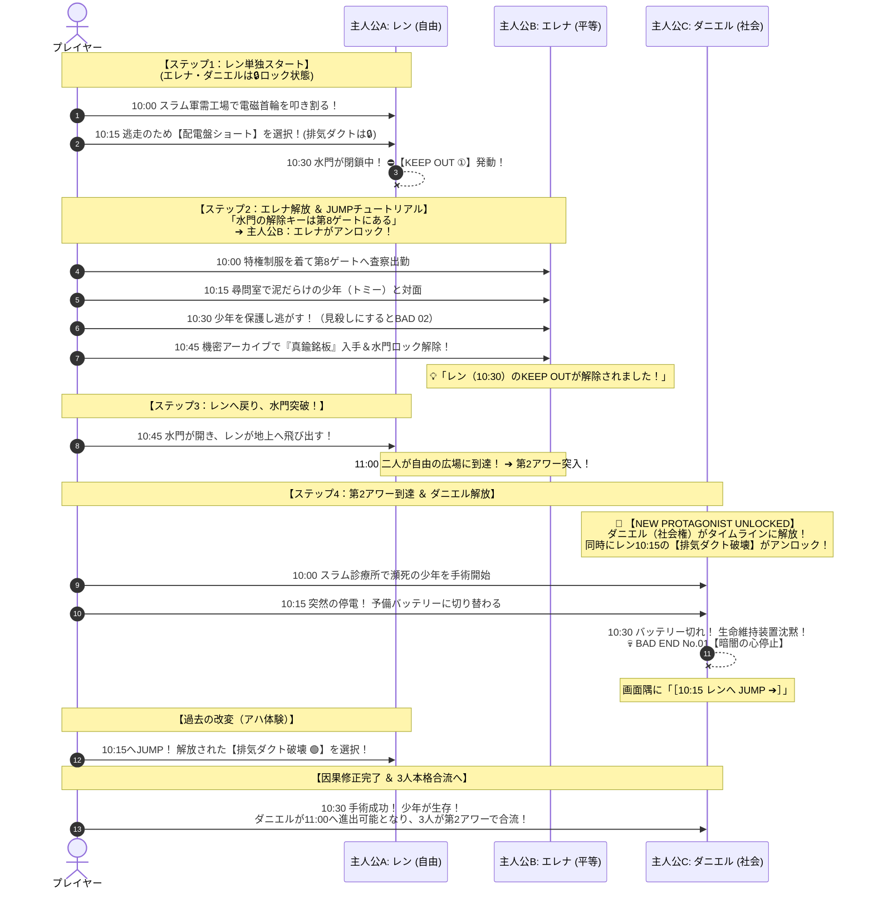

# **『パラレル・ジャパニア：クロニクル 〜失われた人権の180分〜』**
## **第1アワー（10:00〜11:00：自由と平等の胎動）完全シナリオ＆システム設計仕様書**

---

## **1. 第1アワーのコンセプトと段階的チュートリアル設計**

第1アワー（10:00〜11:00）は、生徒や初心者プレイヤーが「428型群像劇」の基本ルール（**ザッピング、KEEP OUT、JUMP、相互干渉**）を誰一人迷うことなく自然に体得できる**【段階的オンボーディング（チュートリアル）】**として機能する。

### **1.1 段階的オンボーディングの4大ステップ**
1. **【ステップ1：レン単独スタート（迷いゼロの導入）】**:
   ゲーム開始時、キャラクター選択画面では **主人公A: レン（自由権）しか選べない**（エレナ・ダニエルはロック状態）。プレイヤーは迷わずレンで脱走劇を開始する。
2. **【ステップ2：初のKEEP OUT体験 ➔ エレナ解放＆JUMP】**:
   レンが10:30の地下水路で「閉ざされた水門」にぶち当たり、初の **⛔ KEEP OUT** が発動。「この水門のロックは第8ゲートでしか解除できない」と告げられ、**主人公B: エレナがアンロック**されてエレナの10:00へ強制/推奨JUMP！
3. **【ステップ3：エレナによるKEEP OUT解除体験】**:
   エレナを10:00から進め、10:45の機密アーカイブで水門ロックを解除。「💡 レン（10:30）のKEEP OUTが解除されました！」の演出を見てレンに戻り、水門を突破して11:00へ到達！
4. **【ステップ4：第2アワー突入 ＆ ダニエル解放（本格群像劇へ）】**:
   自由と平等を勝ち取った瞬間に **主人公C: ダニエル（社会権）** がアンロックされ、3人並行の本格タイムラインへとステップアップ！

---

## **2. 第1アワー 段階的オンボーディング・シーケンス図 (Mermaid)**



---

## **3. タイムライン15分刻み ノード詳細仕様**

---

### ⏱️ 【10:00】

#### 👦 `A_1000`: レン（自由権）『首輪の火花』
* **舞台**: 10:00 スラム地下軍需工場
* **本文**:
  > 油煙と錆の臭いが充満する地下軍需工場。
  > 首筋に食い込んだ電磁首輪が、赤い警告音をピピピと響かせて皮膚をチリチリ焦がしている。
  > 「おいクズ番！ 手を休めるな！」監視ドローンが銃口を向けて巡回してくる。
  > スラムに生まれた者は、一生この暗闇で鉄屑を削り、死ねば廃棄口へ捨てられる。
  > （誰が……誰が一生こんな暗闇で野垂れ死んでたまるかッ！）
  > レンは油塗れの大型レンチを両手で握り締め、自らの喉仏すれすれの電子ロックめがけて渾身の力で叩き割った！
  > バチチッ！と火花が散り、鉄の首輪が砕け散る。
  > 首を絞め付ける冷たさが消えた。息ができる！ <span class='tip-link' data-tip='身体の自由'>自分の足で、どこへだって走っていける</span>んだ！
* **選択肢**:
  * `[選択肢 1]`: 「非常階段を蹴破り、地上への路地裏へ駆け上がる！」 ➔ `A_1015`

#### 👩 `B_1000`: エレナ（平等権）『純白の制服』
* **舞台**: 10:00 中央特権監査局・執務室
* **本文**:
  > 白磁の床に、エレナの革靴の澄んだ足音が響く。
  > 彼女が着る純白の特権制服は、一等血統の証。胸には黄金の監査官章が冷たく輝いている。
  > 「エレナ監査官、第8ゲート境界区画にて、不審な下層民の連行が相次いでおります。至急査察を」
  > 幼い頃から教え込まれてきた。「優れた血筋の我々が統治するからこそ、愚民たちも秩序を保てるのだ」と。
  > だが、執務室の窓から見下ろすスラムの黒煙を見るたび、胸の奥で何かが冷たく疼くのを、エレナは隠し続けていた。
* **選択肢**:
  * `[選択肢 1]`: 「専用車に乗り込み、第8ゲートの尋問室へ向かう」 ➔ `B_1015`

#### 👨 `C_1000`: ダニエル（社会権）『スラム診療所の朝』※初期ロック
* **舞台**: 10:00 地下スラム診療所
* **本文**:
  > 湿った消毒液の臭いと、重い血の匂い。
  > ドアが激しく蹴破られ、泥だらけの男たちが担架を運び込んできた。
  > 「先生！ ダニエル先生！ トミーが……ドローンの銃撃に巻き込まれて……！」
  > 担架の上で、十代前半の少年が胸を押さえて荒い息を吐いている。チアノーゼが出ている。気胸と出血性ショックだ。
  > 「すぐに手術台へ乗せろ！ 予備の輸血パックと酸素吸入器を用意するんだ！」
  > ダニエルはボロボロのゴム手袋を引き裂くように装着した。
* **選択肢**:
  * `[選択肢 1]`: 「緊急開胸手術の準備を開始する」 ➔ `C_1015`

---

### ⏱️ 【10:15】

#### 👦 `A_1015`: レン（自由権）『路地裏の二者択一』
* **舞台**: 10:15 地上検問路地
* **本文**:
  > ドローンの警告サイレンが背後に迫る。
  > 逃げ込んだ路地裏の壁には、「街区全体の主配電盤」と、頭上にそびえる「集中換気ダクトの点検レバー」があった。
* **選択肢（親切UI制御）**:
  * `[選択肢 1]`: 「配電盤をショートさせて街路灯を消し、闇に紛れて逃げる！」（初期選択可能） ➔ `A_1030`（※フラグ `A_BLACKOUT` 成立）
  * `[選択肢 2]`:
    * 【初見時】: `🔒 ？？？？？？？？（第2アワー到達でアンロック）`（グレーアウト）
    * 【ダニエル解放後】: `💨 排気ダクトを破壊し、黒い煙幕を張って追跡ドローンを狂わせる！` ➔ `A_1030_SMOKE`（※フラグ `A_SMOKE` 成立）

#### 👩 `B_1015`: エレナ（平等権）『第8ゲート尋問室』
* **舞台**: 10:15 第8ゲート尋問室
* **本文**:
  > 尋問室の冷たい鉄板の上に、泥だらけの少年が手錠をかけられて震えていた。
  > 警備兵が銃を構えて吐き捨てる。「監査官、このゴミは身分バーコードを持っていません。規定通り即時処分（射殺）します」
  > （※レンが煙幕を選んでいる場合：突然換気口から猛烈な黒煙が噴き出し、警備兵が咳き込んで外へ飛び出す演出が挿入！）
* **選択肢**:
  * `[選択肢 1]`: 「少年の身柄の引き渡しを求め、尋問を開始する」 ➔ `B_1030`

#### 👨 `C_1015`: ダニエル（社会権）『緊急手術の火花』※初期ロック
* **舞台**: 10:15 地下スラム診療所
* **本文**:
  > 「メス！ 吸引器の圧力を上げろ！」ダニエルの額から汗が吹き飛ぶ。
  > （※レンが配電盤ショートを選んでいる場合：パツン！と照明が落ち、赤い非常用予備バッテリーに切り替わる！）
  > 「先生！ 主電源が落ちました！ 予備バッテリーは持ってあと15分です！」
  > 「くそっ、どこかのバカが配電盤を壊しやがったのか！？ 10:30までに意地でも終わらせるぞ！」
* **選択肢**:
  * `[選択肢 1]`: 「手元の明かりを頼りに、必死の止血処置を続ける」 ➔ `C_1030`

---

### ⏱️ 【10:30】

#### 👦 `A_1030`: レン（自由権）『地下水路の鉄扉』
* **舞台**: 10:30 中央地下水路
* **本文**:
  > レンは地下水路へ飛び込んだ。瓦礫の中に、青いペンキが剥げかけた頑丈な鉄板（※新宿区標識）を見つけ、胸当てにする。
  > ドローンの銃弾を鉄板で跳ね返しながら前へ走るが、地上へ抜ける巨大水門の前で立ち往生した。
  > 赤い電子ランプが点滅している。`［水門閉鎖中：第8ゲート監査局キーが必要］`
  > 「くそっ、開かない！ ここで追いつかれたら蜂の巣だぞ！」
* **分岐・制御**:
  * ➔ **⛔ 【KEEP OUT ①】（第8ゲートのエレナへJUMPせよ！）**

#### 👩 `B_1030`: エレナ（平等権）『血統なき少年の瞳』
* **舞台**: 10:30 第8ゲート尋問室
* **本文**:
  > 少年がエレナの足元ですがりつく。「おねえちゃん……ぼく、お腹が空いてパンを拾おうとしただけなんだ……殺さないで……」
  > 警備兵が戻ってくる足音が聞こえる。「処分を急げ！ 門地コードのないゴミを生かしておく価値はない！」
  > エレナの胸が激しく高鳴る。見過ごせば少年は殺される。助ければ自分は反逆者になる。
* **選択肢**:
  * `[選択肢 1]`: 「銃を下ろしなさい！ <span class='tip-link' data-tip='法の下の平等'>生まれついた家柄や血筋で人の命を奪うこと</span>は私が許しません！」（少年を裏口から逃がす） ➔ `B_1045`
  * `[選択肢 2]`: 「……規則に従いなさい」エレナは目を伏せて部屋を出る ➔ **💀 【BAD END No.02：処刑台の露】**

#### 👨 `C_1030`: ダニエル（社会権）『暗闇の心停止』※初期ロック
* **舞台**: 10:30 地下スラム診療所
* **本文（レンが配電盤ショート時）**:
  > ピピーッ……！ 予備バッテリーの残量警告音が鳴り、無影灯が完全に消えた。
  > 暗黒。そして、生命維持装置が沈黙した。
  > 「息をしろ！ 死ぬな！ こんな暗闇の中で死んでたまるか！」
  > ダニエルは少年の胸に飛び乗り、闇の中で心臓マッサージを続けた。
  > だが、掌から急速に体温が失われていく。
  > 遠く地上から、非常サイレンが微かに聞こえていた。どこかの誰かが逃げるために壊した配電盤の代償として、この少年は冷たい鉄板の上で息絶えた。
  > ➔ **💀 【BAD END No.01：暗闇の心停止】（［10:15 レンへ JUMP ➔］）**
* **本文（レンが排気ダクト破壊時）**:
  > 安定した白い光の下、ダニエルの手によって最後の縫合糸が結ばれた。
  > ピコン……ピコン……と規則正しい心電図の音が手術室に響き渡る。
  > 「ふぅ……助かったぞ。自発呼吸が戻った」ダニエルは汗を拭い、少年に毛布をかけた。 ➔ `C_1045`

---

### ⏱️ 【10:45】

#### 👩 `B_1045`: エレナ（平等権）『機密アーカイブの真鍮銘板』
* **舞台**: 10:45 監査局地下アーカイブ
* **本文**:
  > 少年を逃がしたエレナは、監査局最深部の機密端末へ走る。
  > 金庫の奥から、古代の文字列が刻まれた**真鍮の銘板（※憲法原本保管庫）**を発見する。
  > 銘板の解除コードを入力すると、画面が緑に点灯した。
  > `［全区画・地下水路ゲート強制開放］`
  > 「少年、逃げて……！ あなたの生きる場所へ！」
  > *(※エレナの操作により、レンのKEEP OUT ①が完全解除！)*
* **選択肢**:
  * `[選択肢 1]`: 「銘板を懐に収め、中央広場へ脱出する」 ➔ `B_1100`

#### 👦 `A_1045`: レン（自由権）『水門開放と地上への脱出』
* **舞台**: 10:45 中央地下水路
* **本文**:
  > ガコンッ！！ 重々しい音を立てて水門の鉄扉が持ち上がった！
  > 「開いた……！？ 誰が開けてくれたんだ！？」
  > レンは胸の青い鉄板を抱え、水門の向こうの光へ駆け上がる！
* **選択肢**:
  * `[選択肢 1]`: 「階段を登り、地上の自由の広場へ飛び出す！」 ➔ `A_1100`

#### 👨 `C_1045`: ダニエル（社会権）『託された救急箱』※初期ロック
* **舞台**: 10:45 地下スラム診療所
* **本文**:
  > 少年が目を覚まし、かすれた声でダニエルを呼ぶ。「先生……ありがとう……」
  > 「喋るな、まだ安静にしてろ」
  > 「先生、これ……上層街で拾ったんだ。先生にあげる……」
  > 少年が差し出したのは、かすれた赤い十字と印章が刻まれた**古い木箱（※厚生労働省救急箱）**だった。
  > 「これに薬を入れて、みんなを助けて……」
  > ダニエルは木箱を固く抱きしめた。「ああ、約束する」
* **選択肢**:
  * `[選択肢 1]`: 「木箱に薬品を詰め、第2アワーへ進出する」 ➔ `C_1100`

---

### ⏱️ 【11:00】第1アワー終着 ＆ ダニエル解放

#### 👦 `A_1100`: レン『自由の広場』
* 「首輪が外れた！ 俺は地上へ出たんだ！！」

#### 👩 `B_1100`: エレナ『反逆の覚悟』
* 「もう戻れない。私は身分制度のすべてを壊す」

---

## **4. 11:00 ダニエル解放 カットシーン演出仕様**

レンとエレナの両方が `A_1100` / `B_1100` に到達した瞬間、以下の専用カットシーンが画面全体に割り込み再生される。

```
[画面演出]:
1. 画面がガガガッと暗転ノイズでブラックアウト。
2. 心電図のフラット音（ピーーー）と警告赤点滅。
3. スラム診療所で血塗れの白衣を着たダニエルのグラフィック（またはテキスト）。
4. Web Audio API による重厚なアンロックSE（低音チャイム）。

[表示テキスト]:
━━━━━━━━━━━━━━━━━━━━━━━━━━━━━━━━━━━━━━━━━
『……自由だと？ 平等だと？ 笑わせるな。
　首輪を外したところで、パンは降ってこない。
　身分をなくしたところで、病気は消えてくれない。
　働けなくなった者は、自由の広場で静かに飢え死ぬだけだ。』

🚨 【NEW PROTAGONIST UNLOCKED】
主人公C：ダニエル 〜スラム診療所の孤独な医師〜
（社会権・生存権）がタイムラインに解放されました！

同時に、過去のタイムラインに新たな可能性が解放されました。
━━━━━━━━━━━━━━━━━━━━━━━━━━━━━━━━━━━━━━━━━
```

---

### **💡 本仕様書のまとめ**
第1アワーをこの仕様に改修することで、
1. **2人スタートによる分かりやすさ**
2. **ダニエル解放時の驚愕（社会権の必然性）**
3. **時間遡行によるアハ体験（428の快感）**
が完全に実現されます。
