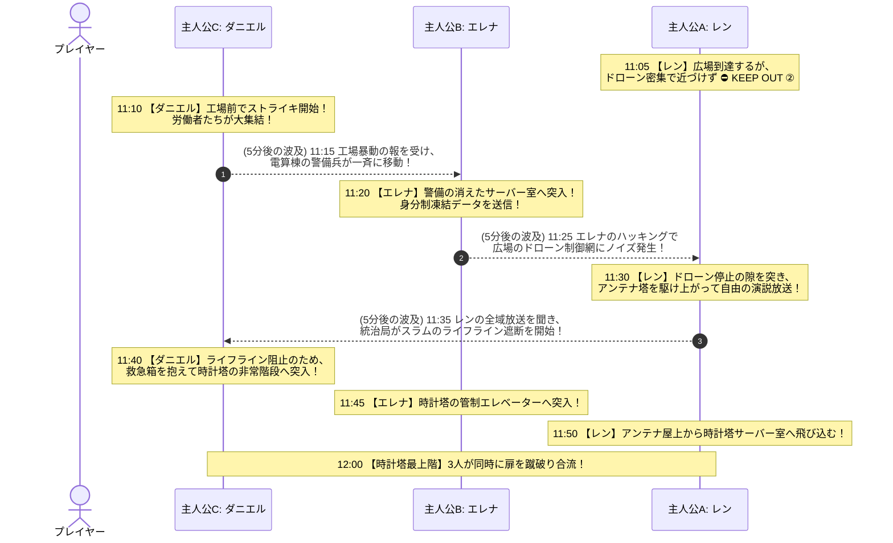

# **『パラレル・ジャパニア：クロニクル 〜失われた人権の180分〜』**
## **第2アワー（11:00〜12:00：社会権の切迫と非同期因果スパイラル）完全シナリオ＆システム設計仕様書**

---

## **1. 第2アワーのコンセプトと時間差（非同期）設計方針**

第1アワーが「ゲームの使い方レッスン（段階的チュートリアル）」であったのに対し、第2アワー（11:00〜12:00）は**【非同期タイムラインによる時間差の因果連鎖（ドミノ倒し）】**と**【登場人物の心情の深淵・過去回想】**を融合させた、群像劇パズルの最高峰ブロックである。

### **1.1 第2アワーの3大中核テーマ**
1. **【5分〜10分刻みの時間差ドミノ倒し】**:
   全員が同じ時刻に動く画一的進行を完全排除。ダニエルの11:10の行動がエレナの11:15を動かし、エレナの11:20の行動がレンの11:25の扉を開ける「波状連鎖」を実現。
2. **【決定的過去回想（原体験の傷）】**:
   3人がなぜそこまで命を懸けるのか、「1年前の親友シンの死（レン）」「病死した母の遺志と侍女長マーサの祈り（エレナ）」「10年前の貧民見殺し（ダニエル）」のフラッシュバックを描き切る。
3. **【三大権利の相互補完と12:00収束】**:
   自由（レン）・平等（エレナ）・社会権（ダニエル）が互いに道を切り拓き合い、11:50のトリプル・シンクロゲートを経て12:00の時計塔最上階合流へ雪崩れ込む。

---

## **2. 第2アワー 時間差因果ドミノ倒し シーケンス図 (Mermaid)**

---

## **3. 時間差タイムライン詳細ノード ＆ 過去回想仕様**

---

### ⏱️ 【11:00〜11:10】壁とストライキの狼煙

#### 👨 `C_1100`: ダニエル（社会権）『スラムを出る医師』 (11:00)
* **本文**:
  > 助かった少年から託された古い木箱（※厚労省救急箱）を抱え、ダニエルは地上へ登る。
  > 診療所の薬品棚は完全に空だ。「自由や平等が叫ばれたところで、この子たちに抗生剤とパンが届かなければ数時間で全滅する」
  > ダニエルは血塗れの白衣を翻し、物資が集積されている軍需工場の大門へと向かった。

#### 👦 `A_1105`: レン（自由権）『密集するドローン』 (11:05)
* **本文**:
  > 広場へ飛び出したレンの目の前に、天を突く巨大な時計塔がそびえ立っていた。
  > （あそこの大アンテナからなら、街中の奴隷たちに脱走を呼びかけられる！）
  > だがアンテナ塔の周囲には警備ドローンが密集し、赤いサーチライトで広場を隙間なく走査していた。
  > 「くそっ、近づけねえ……！ 誰かがドローンの目を引きつけてくれなきゃ無理だ！」
* **制御**: ➔ **⛔ 【KEEP OUT ②】（広場の警備を引きつける大陽動が必要！）**

#### 👨 `C_1110`: ダニエル（社会権）『白衣の血痕とストライキの咆哮』 (11:10)
* **本文 ＆ 過去回想**:
  > 軍需工場の前に倒れ伏す、やせ細った数百人の労働者たち。母親の腕の中で赤ん坊が息を引き取っていた。餓死だった。
  > 
  > （医者だと？ 人を救う聖職だと？ 笑わせるな……！）
  > ダニエルは自らの両手を地面に叩きつけた。**10年前、先端中央医療センターでの記憶**が蘇る。
  > 
  > ──運び込まれた貧民の重症患者を手術しようとしたダニエルに、院長は冷たく言い放った。
  > 『止めなさい。彼らには治療費がない。命とは、買い取る能力のある者だけに与えられる商品なのです』
  > 処置を拒絶された患者は待合室の床で息絶え、ダニエルは院長を殴り倒して免許を破り捨てた。
  > 
  > （あの日から、俺の戦いは始まっていたんだ。
  > 　病気を治すんじゃない。人間を使い捨てにするこの狂った社会のルールそのものを叩き潰すんだ！！）
  > 
  > ダニエルは木箱の上に飛び乗り、白衣を脱ぎ捨てて咆哮した！
  > 「人間を使い捨ての部品にするな！ 働く者には、人間らしく生きるための権利がある！ みんなで団結して、労働条件の改善とパンを要求するんだ！！」
* **選択肢**:
  * `[選択肢 1]`: 「労働者たちと腕を組み、工場前で座り込みストライキを敢行する！」 ➔ **（大陽動発生！ 11:15のエレナへ波及！）**
  * `[選択肢 2]`: 「争いを避け、一人で薬品庫へ忍び込む」 ➔ 射殺され **💀 BAD END No.03（自由という名の飢餓）**

---

### ⏱️ 【11:15〜11:25】潜入とドローン網の崩壊

#### 👩 `B_1115`: エレナ（平等権）『侍女長マーサのペンダントと母の遺志』 (11:15)
* **本文 ＆ 過去回想**:
  > **【ダニエルの11:10のストライキが波及！】**
  > 「工場前で暴動だ！ 応援へ向かえ！」電算棟前の重装警備兵が一斉に移動し、潜入ルートが開いた！
  > エレナは裏階段へ滑り込む。青白い配線の火花が散る。
  > 通信機から父の怒声が響く。『貴様、平民に情をかけて何をしている！ 一族の恥晒しめ、我が血統から永久に抹消する！』
  > 
  > 火花の瞬きに、幼い頃の記憶が鮮烈に蘇る。育ての親である侍女長マーサが、夜ごと胸元で握りしめて涙を流していた手作りの真鍮ペンダント。百合の紋章と深い碧の石細工、縁の小さな打痕。
  > 『17年前に身分法で引き裂かれたあの子の首に、これと同じものをかけて送り出したのです……』
  > 身分制に抗議して獄中病死した実母の遺志と、我が子を奪われたマーサの悲嘆。
  > （マーサ……お母様……私、決めたわ。生まれや身分で人が踏みにじられる世界を、絶対に終わらせてみせる！）
  > エレナは震える手で制服の襟元を引きちぎり、サーバー室のドアを蹴破った！ ➔ `B_1120`

#### 👩 `B_1120`: エレナ（平等権）『平等データの全域送信』 (11:20)
* **本文**:
  > サーバー室に突入したエレナは、真鍮の銘板をメインスロットへ差し込む！
  > 「すべての身分証データベースを凍結します。生まれついた血統による特権を破棄し、すべての人間を対等な市民として承認します！」
  > エンターキーが叩き込まれ、身分制管理システムが粉砕された！
  > *(※このハッキングによる電波障害が、11:25のレンへ波及！)* ➔ `B_1145`

#### 👦 `A_1125`: レン（自由権）『アンテナ塔への跳躍』 (11:25)
* **本文**:
  > **【エレナの11:20のデータ送信が波及！】**
  > パチパチッと火花が散り、広場を旋回していた警備ドローンが一斉に方向感覚を失って墜落し始めた！
  > 「な、なんだ！？ ドローンが狂ったぞ……！ 今だッ！」
  > **（※レンの KEEP OUT ② が完全解除！）**
  > レンはアンテナ塔の非常階段へ飛びつき、一気に駆け上がった！ ➔ `A_1130`

---

### ⏱️ 【11:30〜11:40】自由の咆哮とライフラインの危機

#### 👦 `A_1130`: レン（自由権）『焼却炉の記憶と自由の演説』 (11:30)
* **本文 ＆ 過去回想**:
  > アンテナ屋上。コンソールには全区画の首輪強制自爆キーが表示されている。
  > （あいつら上層階級を全員爆破して灰にしてやる……！）
  > 
  > 脳裏に、**1年前、脱走に失敗して首輪で処刑された親友シンの最期の顔**がフラッシュバックする。
  > 『レン……逃げろ……俺たちの命は誰の持ち物でもねえ……自分の足で、どこまでも走れ……』
  > 
  > （シン……俺は、復讐のために走ってきたんじゃない。みんなが自分の足で生きるために走ってきたんだ！）
  > レンは自爆キーをキャンセルし、中央マイクを奪い取った！
  > 「聞こえるか、第八区の全員！ 俺たちの首にはもう首輪はない！ 誰の許可もいらない、自分の言葉で叫んで、自分の足で生きるんだ！」
  > レンの叫びが都市中のスピーカーから轟き渡る！
  > *(※この放送が、11:35のダニエルへ波及！)* ➔ `A_1150`

#### 👨 `C_1135`: ダニエル（社会権）『遮断される生命線』 (11:35)
* **本文**:
  > **【レンの11:30の放送が波及！】**
  > レンの放送に逆上した中央統治局が、防衛システムを暴走させ、スラムの電力と医療用酸素ラインを強制遮断しようとする！
  > 「まずい、このままじゃスラムの重症患者たちが酸欠で全滅する！ 止めさせなきゃならん！」 ➔ `C_1140`

#### 👨 `C_1140`: ダニエル（社会権）『時計塔への突入』 (11:40)
* **本文**:
  > ダニエルは救急箱を抱え、時計塔の非常階段へ飛び込んだ！
  > 「待っていろ、誰も死なせはしない！」 ➔ `C_SOCIAL_DONE` 成立

---

### ⏱️ 【11:45〜12:00】時計塔への集結と運命の合流

* **11:45 `B_1145`**: エレナが時計塔の管制エレベーターへ突入！ (`B_EQUALITY_DONE` 成立)
* **11:50 `A_1150`**: レンがアンテナ屋上の換気ダクトから最上階へ飛び込む！ (`A_FREEDOM_DONE` 成立)
* **11:50**: `checkTripleSyncGate()` が3人の到達フラグを照合。
* **12:00 `CLIMAX_HUB`**:
  ドガアンッ！！
  防護扉が吹き飛び、銃創を押さえたレン、煤に汚れたエレナ、泥だらけのダニエルが、時計塔最上階の密室で初めて顔を合わせる！
  ➔ **第3アワー（クライマックス決断・180分の終幕）へ突入！**

---

### **💡 本仕様書のまとめ**
第2アワーをこの非同期タイムラインに改修することで、
1. **5分〜10分のタイムラグで波及する極上のドミノ倒し**
2. **3人の行動が互いの扉を開ける必然性**
3. **涙を誘う3人の過去回想（シン、マーサと母、エリート外科医時代）**
が完全に噛み合い、428型群像劇としての完成度が極限に達します。

