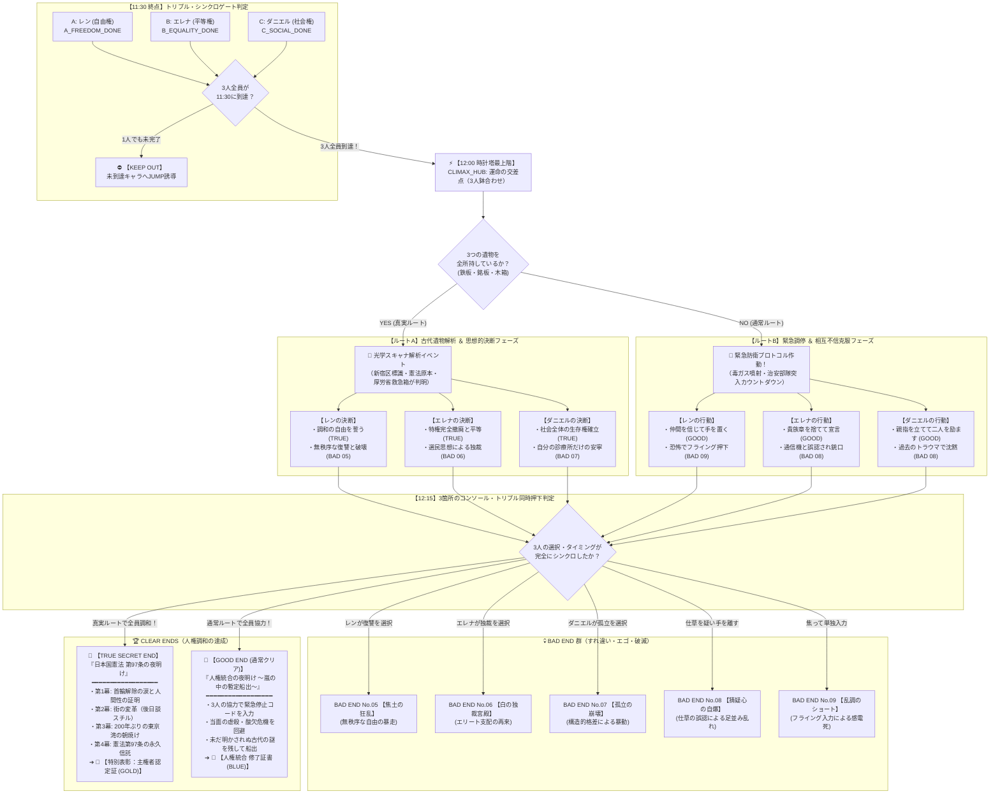

# **『パラレル・ジャパニア：クロニクル 〜失われた人権の180分〜』**
## **至極の428型クライマックス＆エンディング完全シナリオ設計仕様書**

---

## **1. 本書の目的と基本設計思想**

本書は、『パラレル・ジャパニア：クロニクル 〜失われた人権の180分〜』において、プレイヤーが12:00（時計塔最上階）に到達した後の**クライマックスから全エンディングに至るシナリオ構造、心理サスペンス、分岐ロジック、およびテキスト仕様**を完全定義する詳細設計書である。

### **1.1 428型群像劇としての3大コア原則**
1. **【叙述トリックの絶対死守】**:
   冒頭から中盤にかけては徹底して「架空のサイバーパンク・ディストピアSF」として没頭させ、「未来の日本」「日本国憲法」という真実は真エンディングのデコード演出で初めて明かされる。
2. **【主観モノローグのズレと誤解の連鎖】**:
   同じ部屋、同じ緊迫した状況であっても、3人の内面で見えている世界・トラウマ・思考回路は全く異なる。些細な仕草（沈黙、汗を拭う、ポケットの手）が他者の視点では致命的な裏切りに見える「心理的すれ違い」をザッピングによって解きほぐす。
3. **【3箇所同時押下（トリプル・シンクロ・キー）ギミック】**:
   1人では絶対に手が届かない三角形に離れた3つのコンソール。3人が否が応でも協力し、それぞれの覚悟を選んで「せーので同時に押す」ことで、自由・平等・社会権の不可分性を身体感覚として体得させる。

---

## **2. エンディング遷移 全体フローチャート (Mermaid)**



---

## **3. ルート別 詳細シナリオ＆テキスト仕様**

---

### **3.1 【ルートA：真実の探究ルート（遺物3種保持時）】**

スキャナ上に置かれた「青い鉄板」「真鍮銘板」「古い木箱」が青い光に包まれ、古代日本の文字（漢字）が復元される。
真実を知った3人は、中央コンソールに表示される「未来の都市統治プロトコル」に対し、思想的誓約を迫られる。

#### **① レン（自由権）の決断ノード: `CLIMAX_DECISION_A`**
* **モノローグ**:
  > （目の前の画面が激しく明滅している。
  > 　『東京都 新宿区』──かつてこの街が存在した国の名前。
  > 　そこには、誰もが自分の行きたい場所へ行き、誰にも支配されない自由があったという。
  > 　今、俺の手の中にあるコンソールには【全市民の首輪一斉強制自爆】と【全首輪の恒久安全解除】の二つのキーが表示されていた。
  > 　俺を家畜のように扱ってきた上層階級の連中……あいつらを皆殺しにして、奪われた人生の復讐を果たすか？
  > 　それとも……あいつらの命も含めて、誰もが縛られない新しい世界を創るのか？）
* **選択肢**:
  1. `【調和の自由】`：「俺だけの自由じゃない。誰もが自分の足で歩き、互いを傷つけない自由を誓う！」 ➔ **（TRUE ENDフラグ成立）**
  2. `【復讐の破壊】`：「知るか！ 憎い上層階級を皆殺しにして、すべてを灰燼に帰してやる！」 ➔ **【BAD END No.05：焦土の狂乱】**

#### **② エレナ（平等権）の決断ノード: `CLIMAX_DECISION_B`**
* **モノローグ**:
  > （『日本国憲法 第三章 原本保管庫』──真鍮の銘板に刻まれた文字が、私の瞳を射抜く。
  > 　門地による差別を禁じる法。私が生まれ育ち、誇りにしてきた『一等血統』という特権は、かつて人類が永久に葬り去ったはずの悪習だったのだ。
  > 　コンソールが冷たく語りかけてくる。
  > 　『現行の貴族管理ネットワークを維持し、あなた自身が最高監査官として全権を掌握しますか？』
  > 　私が権力を握れば、賢明で慈悲深い統治ができるかもしれない。愚民たちに余計な自由を与えて混乱させるより、私が導くべきではないのか？）
* **選択肢**:
  1. `【平等の誓約】`：「華族も特権もいらない！ 私の制服を焼き捨て、すべての人間が法の下に平等な社会を誓う！」 ➔ **（TRUE ENDフラグ成立）**
  2. `【独裁の受容】`：「民衆には指導者が必要よ。私が正しい特権層として彼らを導いてあげるべきだわ」 ➔ **【BAD END No.06：白の独裁宮殿】**

#### **③ ダニエル（社会権）の決断ノード: `CLIMAX_DECISION_C`**
* **モノローグ**:
  > （『厚生労働省 災害備蓄用医療箱』……古びた木箱の焼き印に指を滑らせる。
  > 　かつての世界には、貧しい者も病める者も、国が見捨てることなく『健康で文化的な最低限度の生活』を支え合う仕組みがあった。
  > 　コンソールの警告ランプが赤く点滅している。
  > 　『生存エネルギーの供給先を選択してください。現行スラム区画のみへの緊急配分か、全都市における恒久生存権の制度化か』
  > 　目の前の診療所の子供たちを救うだけなら、スラムにだけ電力を回せばいい。だが、それでは都市の構造的搾取は何も変わらない。
  > 　俺が背負うべきは、目の前の命だけか？ それとも、これから生まれてくるすべての命なのか？）
* **選択肢**:
  1. `【生存権の確立】`：「誰もが人間らしく生き、倒れた者を社会全体で支え合う権利を、永久の基本法に刻み込む！」 ➔ **（TRUE ENDフラグ成立）**
  2. `【狭隘な安寧】`：「大きな社会のことなど知らん！ 目の前の自分の診療所の患者さえ助かれば十分だ！」 ➔ **【BAD END No.07：孤立の崩壊】**

---

### **3.2 【ルートB：通常緊急ルート（遺物不足時）】**

3つの遺物は揃っておらず、古代の歴史の真相は闇の中。
しかし、防衛毒ガスが噴射され、治安部隊の足音が迫る極限の1分間の中で、3人は**「互いの仕草による誤解」**を乗り越えて緊急停止ボタンを同時に押さなければならない。

#### **① ダニエルの「沈黙」とレンの「猜疑心」**
* **ダニエル視点**:
  > （かつて手術室で失った少年の顔が浮かび、胸が締め付けられる。
  > 　祈るように目を閉じ、一瞬だけコンソールから手を引いて息を整えた。）
* **レン視点（ザッピング前）**:
  > （医者のおっさんが急に押し黙り、手を引っ込めやがった！
  > 　自分だけ助かる裏コードを探しているのか！？ 信用できるか！）
* **解決アクション（ダニエルの選択肢）**:
  * `【弱音を捨て、力強く声をかける】`:
    「レン、エレナ！ ビビるな、俺が二人を絶対に生きて帰す！ いくぞ！！」
    ➔ **レンのテキストが変化し、疑心が解ける！**

#### **② エレナの「襟元の手」とダニエルの「警戒」**
* **エレナ視点**:
  > （息苦しさに耐えかね、襟元を少し緩めて首筋の汗を拭った。）
* **ダニエル視点（ザッピング前）**:
  > （エレナが首筋の通信機に手を当てた！ 増援の治安部隊を呼んでいるのか！？）
* **解決アクション（エレナの選択肢）**:
  * `【胸の貴族章を引きちぎり、床へ投げ捨てる】`:
    「私はもう監査官ではないわ！ あなたたちと共に生きる一人の人間よ！」
    ➔ **ダニエルのテキストが変化し、警戒が解ける！**

#### **③ レンのお守りとフライング押下の恐怖**
* **レンの選択肢**:
  * `【合図を信じて、二人の呼吸に合わせて押し込む】` ➔ **（GOOD END成立）**
  * `【恐怖に耐えかね、フライングでボタンを叩く】` ➔ **【BAD END No.09：乱調のショート】**

---

## **4. 全BAD END（No.01〜No.09）完全一覧表**

| 結末ID | 結末タイトル | 発生契機・操作キャラ | 破滅の一人称ドラマ（地獄の解像度） | 公民的アハ体験 |
| :--- | :--- | :--- | :--- | :--- |
| **BAD_01** | **暗闇の心停止** | 10:25 ダニエル (A停電) | 手術中に無影灯が消え、生命維持装置が沈黙。闇の中で心臓マッサージを続けるが少年の体温が失われていく絶望。 | 他者の生命を脅かす自由はない（公共の福祉）。 |
| **BAD_02** | **処刑台の露** | 10:20 エレナ (少年見殺し) | 少年を見捨てたエレナ自身が、やがて「血統に平民の血が混ざっている」として監査局に粛清され、冷たい法廷で処刑台へ送られる。 | 平等なき社会では、特権層の人間すら容易に使い捨てにされる。 |
| **BAD_03** | **自由という名の飢餓** | 11:30 ダニエル (スト断念) | 自由を手に入れたがパンも薬もない街。重症者が溢れ返り、暴徒と化した市民が診療所を焼き討ちし、ダニエルも炎に包まれる。 | 自由だけでは人は生きられない（社会権・生存権の不可欠性）。 |
| **BAD_04** | **魂の家畜** | 11:30 レン (言論放棄) | マイクを捨て逃げたレン。首輪は外れたが、配給パンを機械のように貪り何も考えず生きる「魂の家畜」に成り果てる。 | 生存のために表現の自由を捨てれば待つのは全体主義の飼育場。 |
| **BAD_05** | **焦土の狂乱** | 12:15 レン (復讐選択) | レンが無秩序な復讐を選び、全都市のエネルギーを暴走させる。スラムも上層街も火の海に包まれ、街全体が自滅する。 | 秩序と他者尊重なき自由は、ただの野蛮な暴力と共倒れを生む。 |
| **BAD_06** | **白の独裁宮殿** | 12:15 エレナ (独裁選択) | エレナが新たな指導者として君臨するが、かつての父と同じ冷酷な選民統治へと堕落。数年後、反乱軍の凶弾に倒れる。 | 特権による支配は、いかに善意から始まっても必ず専制と腐敗を招く。 |
| **BAD_07** | **孤立の崩壊** | 12:15 ダニエル (孤立選択) | 自分の診療所だけに電力を引いたダニエル。だが周辺の餓死した難民の群れが診療所へ殺到し、全員が押し潰される。 | 社会全体の福祉と権利を守らなければ、個人の幸福も維持できない。 |
| **BAD_08** | **猜疑心の自爆** | 12:15 全員 (仕草の誤認) | 沈黙や汗を拭う仕草を「裏切り」と誤認。互いに銃を向け合って撃ち合い、その間に防衛毒ガスが部屋を満たして全滅。 | 対話と言葉による意思疎通なき社会は、猜疑心によって内側から自壊する。 |
| **BAD_09** | **乱調のショート** | 12:15 レン (フライング) | 恐怖で1人だけ早くボタンを押したレン。不揃いな回路に高圧電流が逆流し、3人ともコンソール前で感電死する。 | 一人の抜け駆けや自分勝手な行動は、全体の合意と調和を水泡に帰す。 |

---

## **5. 表彰状・PDF出力仕様**

```
+-----------------------------------------------------------------------------+
|                                                                             |
|   特 別 表 彰 ： 主 権 者 認 定 証                                            |
|   PARALLEL JAPANIA CHRONICLE : CONSTITUTIONAL COMPLETE                      |
|                                                                             |
|                         サ サ キ   タ ロ ウ   殿                             |
|                                                                             |
|     あなたは、失われた人権の暗黒時代を駆け抜け、                            |
|     自由・平等・社会権の三位一体の調和を解き明かしました。                  |
|     古代の幾何学模様に刻まれた『日本国憲法』の真実に到達し、                |
|     人間としての尊厳を自らの手で取り戻した主権者であることを、              |
|     ここに深く称えます。                                                    |
|                                                                             |
|   『日本国憲法 第97条：基本的人権は、人類の自由獲得の努力の成果であつて、     |
|     永久の権利として信託されたものである。』                                |
|                                                                             |
|   授与日: 2026年9月4日                 極東統治特区・第八区 人権審判機関    |
|                                                     [ 永久信託 / 認定之印 ] |
+-----------------------------------------------------------------------------+
```

* **通常クリア時（GOOD END）**:
  * タイトル：『人権統合 修了証書』
  * ベースカラー：セルリアンブルー（#0284c7）
  * 授与機関名：『パラレル・クロニクル 統治調停委員会』
* **真エンディング時（TRUE SECRET END）**:
  * タイトル：『特別表彰：主権者認定証』
  * ベースカラー：ディープブラック＆ゴールド（#0a0d14 / #eab308）
  * 刻印条文：日本国憲法 第九十七条 全文
  * 印章：二重円ベクター刻印『永久信託 / 認定之印』

---

### **💡 本仕様書のまとめ**
本仕様に基づく改修により、本作は単なる学習クイズゲームを遥かに凌駕し、**「プレイヤー自らの意思と他者への信頼によって人権の夜明けを勝ち取る、一生モノの体験」**へと昇華します。
